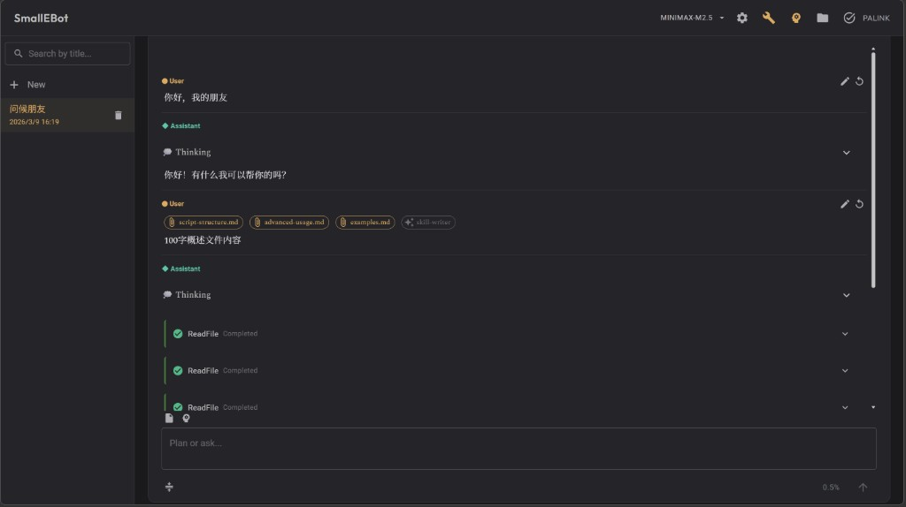

# SmallEBot

English | [简体中文](README.md)

A local AI assistant built with ASP.NET Core Blazor Server. **Runs locally on your machine** — no remote server needed. Your PC is the server.



## Features

- **Multi-conversation**: Create, switch, and delete conversations; history stored per user. Sidebar supports search by conversation title.
- **CLI-style UI**: Linear message flow (● User / ◆ Assistant) with collapsible thinking and tool-call panels.
- **Message edit & restart**: Edit a user message and resend, or restart the conversation from any user message.
- **Thinking mode**: Toggle extended reasoning (e.g. DeepSeek Reasoner) via Anthropic thinking support. Reasoning is displayed in a collapsible panel, followed by the final text response.
- **Model switching**: Switch between multiple configured models via the app bar dropdown.
- **MCP tools**: Connect to Model Context Protocol servers for extended capabilities (filesystem, web search, databases, etc.).
- **Skills**: File-based skills under workspace `.agents/vfs/sys.skills/` and `.agents/vfs/skills/` (read-only in workspace); create custom skills via app UI, add to `skills/` with YAML frontmatter, or generate new skills based on conversation patterns.
- **Terminal**: Execute shell commands via `ExecuteCommand` tool. Configurable command blacklist. Optional command confirmation and whitelist.
- **Workspace**: Agent file tools and ExecuteCommand scoped to `.agents/vfs/`. Browse files via the Workspace drawer (refreshes via FileSystemWatcher).
- **Task list**: Assistant can manage a task list per conversation via tools; Task List drawer stays in sync.
- **Context compression**: Automatically compresses conversation history when context reaches threshold. Manual compress via button. Summary merged with existing context, injected into system prompt.
- **Themes**: Multiple UI themes (dark, light, terminal style, etc.) with persistence.
- **No login**: First visit asks for a username; data is scoped by that name.

## Tech Stack

| Layer | Technology |
|-------|------------|
| Runtime | .NET 10 |
| UI | Blazor Server + MudBlazor |
| Agent | Microsoft Agent Framework (Anthropic) |
| LLM | DeepSeek (Anthropic-compatible API) or other Anthropic-compatible endpoints |
| Data | EF Core + SQLite |

## Project Structure

```
SmallEBot/
├── SmallEBot/                    # Main project (Blazor Server host)
│   ├── Program.cs                # Application entry point
│   ├── appsettings.json          # Configuration
│   ├── Components/               # Razor components
│   │   ├── Layout/               # Layout components
│   │   ├── Chat/                 # CLI-style chat area, message editing, streaming
│   │   ├── Workspace/            # Workspace drawer components
│   │   ├── TaskList/             # Task list drawer
│   │   ├── Terminal/             # Terminal-related components
│   │   ├── Agent/                # Model selector, etc.
│   │   ├── Skills/               # Skills configuration
│   │   └── Mcp/                  # MCP configuration
│   ├── Services/                 # Host-specific services
│   │   ├── Circuit/              # Blazor Circuit context
│   │   └── Presentation/        # Keyboard shortcuts, Markdown, etc.
│   └── Extensions/               # Extension methods (DI registration)
│
├── SmallEBot.Core/               # Core layer (no external dependencies)
│   └── Models/                   # Shared models
│
├── SmallEBot.Domain/             # Domain layer (no external dependencies)
│   ├── Agents/Config/            # Agent config aggregate, repository interface
│   ├── Conversations/Metadata/   # Conversation metadata, repository interface
│   ├── UserPreferences/         # User preferences
│   └── Workspaces/               # Workspace read-only policy
│
├── SmallEBot.Application.Contracts/  # Application contracts (interfaces)
│   ├── Agents/                   # Config, Compression, Execution, Tools, Mcp, Skills
│   ├── Conversations/            # Conversation, Session, TaskList
│   ├── Workspaces/               # VFS, Workspace services
│   └── UserPreferences/         # UserPreferences services
│
├── SmallEBot.Application/        # Application layer
│   ├── Conversations/            # ConversationService
│   ├── Agents/                   # AgentBuilder, AgentRunner, Compression, Context
│   ├── Workspaces/               # WorkspaceService
│   └── UserPreferences/         # UserPreferencesService
│
├── SmallEBot.Infrastructure/     # Infrastructure layer
│   ├── Agents/                   # Config, Mcp, Skills, Tools, Tokenizers
│   ├── Conversations/            # Metadata, Session, TaskList
│   ├── Workspaces/               # VirtualFileSystem, WorkspaceWatcher
│   ├── UserPreferences/          # UserPreferenceRepository
│   └── Migrations/               # EF Core migrations
│
├── .agents/                      # Runtime data directory (auto-created)
│   ├── vfs/                      # Workspace (Agent file operations scope)
│   │   ├── sys.skills/           # System skills (read-only in workspace)
│   │   └── skills/               # User custom skills (read-only in workspace)
│   ├── conversations/{id}/      # Per-conversation metadata.json, session.json, tasks.json
│   ├── .mcp.json                 # MCP configuration
│   ├── .sys.mcp.json             # System MCP configuration
│   ├── terminal.json             # Terminal configuration
│   └── models.json               # Model configurations
│
└── docs/plans/                   # Design documents (archives/ = historical)
```

### Architecture Dependencies

```
SmallEBot.Core              → (no deps) — models
SmallEBot.Domain            → (no deps) — entities, value objects, repository interfaces
SmallEBot.Application.Contracts → Core, Domain — service interfaces
SmallEBot.Application       → Core, Domain, Application.Contracts — orchestration
SmallEBot.Infrastructure    → Core, Domain, Application.Contracts — persistence, VFS, tools
SmallEBot (Host)            → Core, Domain, Application, Application.Contracts, Infrastructure — Blazor UI, DI
```

## Quick Start

### Prerequisites

- .NET 10 SDK

### Run

```bash
# After cloning, run from repo root
dotnet run --project SmallEBot
```

Open the URL shown in the console (e.g. `https://localhost:5xxx`).

### Configure API Key

**Do not commit secrets to the repository!** Recommended methods:

#### Option 1: Environment Variable (PowerShell)

```powershell
$env:ANTHROPIC_API_KEY = "your-api-key"; dotnet run --project SmallEBot
```

#### Option 2: User Secrets

```bash
cd SmallEBot
dotnet user-secrets set "Anthropic:ApiKey" "your-api-key"
```

#### Option 3: appsettings.json (local development only)

Edit `SmallEBot/appsettings.json`:

```json
{
  "Anthropic": {
    "BaseUrl": "https://api.deepseek.com/anthropic",
    "ApiKey": "your-api-key",
    "Model": "deepseek-reasoner",
    "ContextWindowTokens": 128000
  }
}
```

## Configuration

### appsettings.json Options

| Option | Description | Default |
|--------|-------------|---------|
| `Anthropic:BaseUrl` | API endpoint URL | `https://api.deepseek.com/anthropic` |
| `Anthropic:ApiKey` | API key | empty (must configure) |
| `Anthropic:Model` | Model name | `deepseek-reasoner` |
| `Anthropic:ContextWindowTokens` | Context window size | `128000` |

### Runtime Data Directory

All runtime data is stored in the application directory:

| File/Directory | Description |
|----------------|-------------|
| `smallebot.db` | SQLite database |
| `smallebot-settings.json` | User preferences |
| `.agents/vfs/` | Workspace (Agent file operations scope) |
| `.agents/vfs/sys.skills/` | System skills (view only in workspace; no delete/write) |
| `.agents/vfs/skills/` | User skills (view only in workspace; no delete/write) |
| `.agents/.mcp.json` | MCP server configuration |
| `.agents/terminal.json` | Terminal security configuration |
| `.agents/models.json` | Model configurations (switch via Settings or AppBar) |
| `.agents/conversations/{id}/tasks.json` | Per-conversation task list |

## Usage Guide

### Basic Chat

1. Enter a username on first visit
2. Type a question in the chat box and press Enter (or Ctrl+Enter)
3. The assistant will stream the reply in real-time
4. Use the edit button on a user message to change and resend

### Context Attachments

In the chat input:

- Type `@` to attach workspace files (file content is injected into the conversation context)
- Type `/` to attach skills (assistant automatically loads skill content)
- Drag and drop files to upload to workspace

### Thinking Mode

Click the "Thinking" button next to the input to toggle. When enabled, the assistant shows its reasoning process in a collapsible panel, followed by the final text response (requires a model that supports thinking, e.g., DeepSeek Reasoner).

### Model Switching

Use the dropdown in the app bar to switch between configured models. Models are configured in `.agents/models.json` via Settings or managed through the model configuration dialog.

### Conversation Sidebar

- Create, switch, and delete conversations
- Search box at the top filters conversations by title

### Workspace

Click the "Workspace" button in the app bar to open the sidebar:

- Browse files in `.agents/vfs/` directory
- Preview file contents
- Agent file read/write operations are scoped to this directory

### Skills Management

Click the "Skills" button in the app bar:

- View installed skills
- Create new skills (under workspace `.agents/vfs/skills/`; view-only in workspace)
- Skills are `SKILL.md` files with YAML frontmatter

### MCP Servers

Click the "MCP" button in the app bar:

- Configure external MCP servers
- System-level MCP in `.agents/.sys.mcp.json`
- User-level MCP in `.agents/.mcp.json`

### Terminal Configuration

Click the "Terminal" button in the app bar:

- **Blacklist**: Command prefixes that are blocked
- **Require Confirmation**: When enabled, commands require approval before execution
- **Whitelist**: Approved command prefixes (auto-added)

## Built-in Tools

The assistant can use the following tools:

| Tool | Description |
|------|-------------|
| `GetCurrentTime` | Get current local time |
| `GetWorkspaceRoot()` | Get workspace root absolute path (no args); for MCP or script paths |
| `ReadFile(path)` | Read workspace file |
| `WriteFile(path, content)` | Write workspace file |
| `AppendFile(path, content)` | Append content to a file (creates if missing) |
| `ListFiles(path?)` | List workspace directory contents |
| `CopyDirectory(sourcePath, destPath)` | Copy a directory and its contents recursively to another path |
| `FindBlobs(pattern, ...)` | Search file names by pattern (glob/regex) |
| `Grep(pattern, ...)` | Search file content (supports regex) |
| `ReadSkill(skillName)` | Load skill file |
| `ReadSkillFile(skillId, relativePath)` | Read file inside a skill |
| `ListSkillFiles(skillId, path?)` | List files inside a skill |
| `ExecuteCommand(command)` | Execute shell command |
| `SetTaskList(tasksJson)` | Create task list |
| `ListTasks` | View task list |
| `CompleteTask(taskId)` | Mark task as done |
| `ClearTasks` | Clear task list |
| `ReadConversationData()` | Get timeline of current conversation (messages, tool calls, thinking) |
| `GenerateSkill(...)` | Create new skill from analyzed patterns |

## Development Commands

```bash
# Build project
dotnet build

# Run project
dotnet run --project SmallEBot

# Add EF Core migration
dotnet ef migrations add <MigrationName> --project SmallEBot.Infrastructure --startup-project SmallEBot
```

**PowerShell**: Use `;` to chain commands, not `&&`.

For architecture and Claude Code guidance, see [CLAUDE.md](CLAUDE.md).
For Cursor, see [AGENTS.md](AGENTS.md).

## License

Apache License 2.0

Copyright 2025-2026 PALINK

Contact: 1006282023@qq.com
