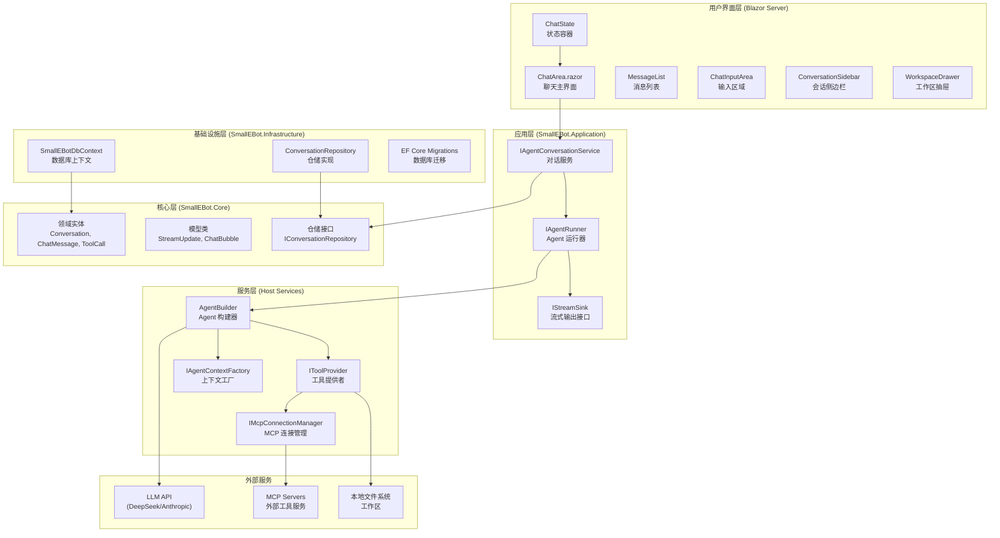
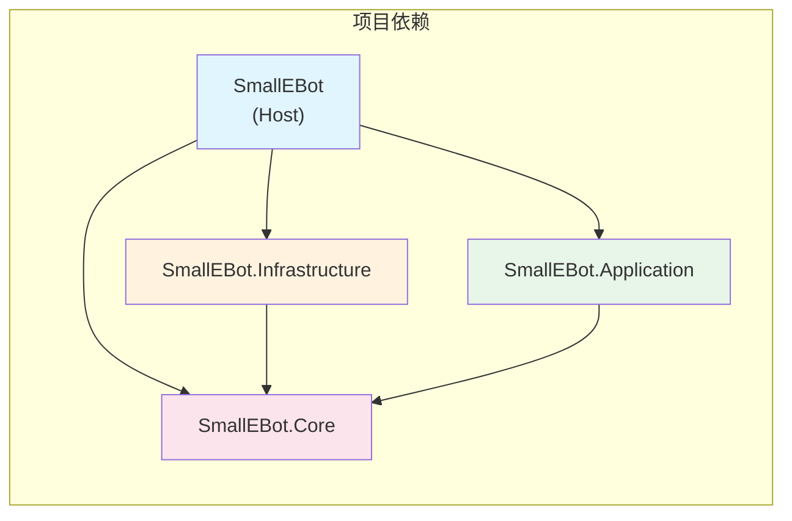
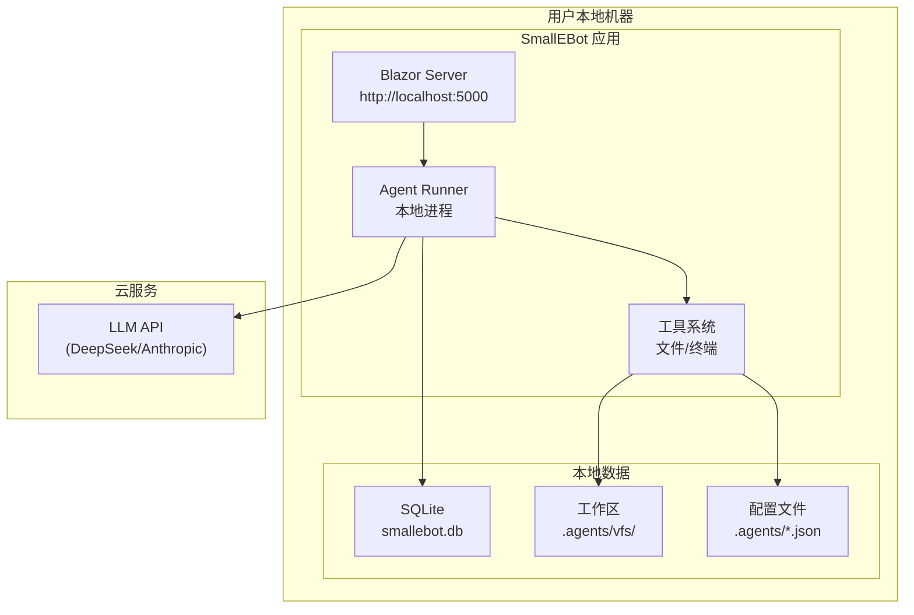

# 系统架构

## 1. 系统概述

### 1.1 核心特性

SmallEBot 是一个本地运行的 AI 助手应用，具备以下核心特性：

- **本地部署**: 应用程序完全运行在用户本地机器上
- **实时流式输出**: 支持大语言模型响应的实时流式显示
- **扩展工具系统**: 支持内置工具、MCP 工具和自定义技能
- **上下文管理**: 自动进行上下文压缩和 Token 估算
- **工作区隔离**: 提供虚拟文件系统用于文件操作

### 1.2 系统组件

| 组件 | 职责 |
|------|------|
| **Blazor UI** | 用户界面，基于 SignalR 实现实时通信 |
| **Conversation Pipeline** | 对话管理，协调消息发送和响应流式处理 |
| **Agent System** | AI Agent 管理，系统提示词构建和工具聚合 |
| **Tool System** | 工具系统，提供文件、终端、技能等能力 |
| **MCP Integration** | 模型上下文协议集成，连接外部工具服务 |
| **Data Layer** | 数据持久化，SQLite + EF Core |

---

## 2. 系统架构图

### 2.1 整体架构



### 2.2 架构说明

#### 2.2.1 用户界面层

基于 Blazor Server 构建，使用 SignalR 实现服务端渲染和实时通信：

- **ChatArea**: 聊天主界面编排组件
- **ChatState**: 状态容器，管理所有 UI 状态并通过事件通知变更
- **MessageList**: 渲染用户和助手消息气泡
- **ChatInputArea**: 输入区域，支持附件和技能引用
- **ConversationSidebar**: 会话列表侧边栏
- **WorkspaceDrawer**: 工作区文件浏览器

#### 2.2.2 应用层

定义核心业务接口和对话处理管道：

- **IAgentConversationService**: 对话 CRUD 和消息发送管道
- **IAgentRunner**: 运行 Agent 并返回流式更新
- **IStreamSink**: 接收流式更新的接口

#### 2.2.3 服务层

宿主层实现的具体服务：

- **AgentBuilder**: 构建和缓存 AIAgent 实例
- **IToolProvider**: 工具提供者接口，支持多种工具类型
- **McpConnectionManager**: 管理 MCP 服务器连接
- **AgentContextFactory**: 构建系统提示词

#### 2.2.4 核心层

纯领域模型，无外部依赖：

- **领域实体**: Conversation, ChatMessage, ToolCall, ThinkBlock, ConversationTurn
- **模型类**: StreamUpdate 及其子类、ChatBubble
- **仓储接口**: IConversationRepository

#### 2.2.5 基础设施层

数据持久化实现：

- **SmallEBotDbContext**: EF Core 数据库上下文
- **ConversationRepository**: 仓储接口实现
- **Migrations**: 数据库迁移文件

---

## 3. 分层依赖关系

### 3.1 项目依赖图



### 3.2 依赖规则

| 项目 | 依赖项 | 说明 |
|------|--------|------|
| **SmallEBot.Core** | 无 | 纯领域模型，零外部依赖 |
| **SmallEBot.Application** | Core | 定义业务接口，引用领域模型 |
| **SmallEBot.Infrastructure** | Core | 实现数据持久化，引用领域模型 |
| **SmallEBot (Host)** | Core, Application, Infrastructure | 组装所有层，实现接口 |

---

## 4. 部署模型

### 4.1 本地部署架构



### 4.2 运行时数据路径

| 路径 | 用途 |
|------|------|
| `smallebot.db` | SQLite 数据库文件 |
| `smallebot-settings.json` | 用户偏好设置 |
| `.agents/vfs/` | 工作区虚拟文件系统 |
| `.agents/.mcp.json` | 用户 MCP 配置 |
| `.agents/.sys.mcp.json` | 系统 MCP 配置 |
| `.agents/terminal.json` | 终端安全配置 |
| `.agents/models.json` | 模型配置 |
| `.agents/tasks/` | 每个会话的任务列表 |

---

## 5. 关键设计决策

### 5.1 为什么选择 Blazor Server

- **实时性**: SignalR 原生支持实时通信，适合流式输出场景
- **安全性**: 敏感逻辑在服务端执行，不暴露给客户端
- **简化部署**: 单一进程，无需前后端分离
- **本地优先**: 用户数据完全在本地，符合隐私需求

### 5.2 为什么分层架构

- **关注点分离**: 每层只关注自己的职责
- **可测试性**: 核心逻辑与基础设施解耦，便于单元测试
- **可扩展性**: 新功能可以通过实现接口的方式扩展
- **维护性**: 清晰的依赖关系，降低维护成本

### 5.3 为什么使用 MCP

- **标准化**: Model Context Protocol 提供统一的工具集成标准
- **生态兼容**: 可以使用社区提供的 MCP 服务器
- **灵活性**: 用户可以自定义配置外部工具服务

---

## 6. 扩展性设计

### 6.1 工具扩展

通过实现 `IToolProvider` 接口添加新工具：

```csharp
public interface IToolProvider
{
    string Name { get; }
    bool IsEnabled { get; }
    IEnumerable<AITool> GetTools();
    TimeSpan? GetTimeout(string toolName);
}
```

### 6.2 MCP 扩展

通过配置 `.agents/.mcp.json` 添加外部 MCP 服务器：

```json
{
  "mcpServers": {
    "server-name": {
      "command": "npx",
      "args": ["-y", "@example/mcp-server"]
    }
  }
}
```

### 6.3 技能扩展

通过 `.agents/vfs/skills/` 目录添加自定义技能文件。
