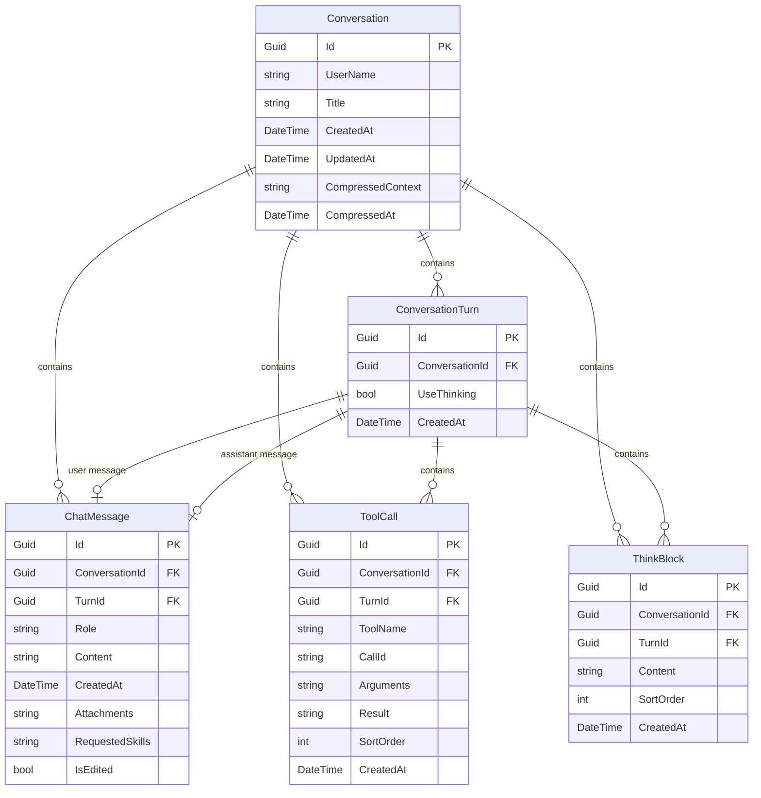
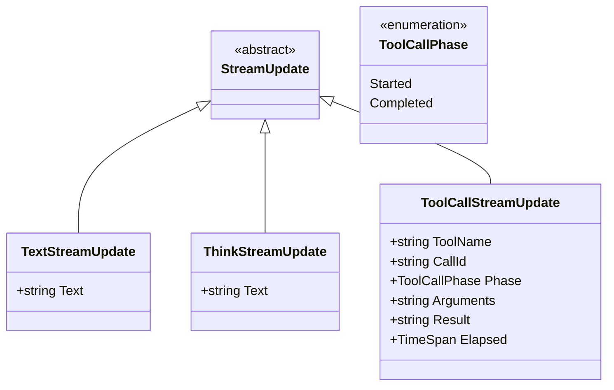

# 核心层 (SmallEBot.Core)

## 1. 层级职责

核心层是整个系统的基石，包含：

- **领域实体**: 业务核心数据结构
- **模型类**: 数据传输对象和视图模型
- **仓储接口**: 数据访问抽象

**设计原则**: 核心层不依赖任何外部库，保持纯净。

---

## 2. 领域实体

### 2.1 实体关系图



### 2.2 Conversation 实体

会话聚合根，包含所有对话相关的数据：

```csharp
public class Conversation
{
    public Guid Id { get; set; }
    public string UserName { get; set; } = string.Empty;
    public string Title { get; set; } = "New conversation";
    public DateTime CreatedAt { get; set; }
    public DateTime UpdatedAt { get; set; }

    // 上下文压缩
    public string? CompressedContext { get; set; }
    public DateTime? CompressedAt { get; set; }

    // 导航属性
    public ICollection<ChatMessage> Messages { get; set; }
    public ICollection<ToolCall> ToolCalls { get; set; }
    public ICollection<ThinkBlock> ThinkBlocks { get; set; }
    public ICollection<ConversationTurn> Turns { get; set; }
}
```

### 2.3 ChatMessage 实体

聊天消息，支持用户和助手两种角色：

```csharp
public class ChatMessage
{
    public Guid Id { get; set; }
    public Guid ConversationId { get; set; }
    public Guid? TurnId { get; set; }
    public string Role { get; set; } = "user"; // "user" | "assistant"
    public string Content { get; set; } = string.Empty;
    public DateTime CreatedAt { get; set; }

    // 附件和技能引用
    public string? Attachments { get; set; }  // JSON array
    public string? RequestedSkills { get; set; }  // JSON array
    public bool IsEdited { get; set; }
}
```

### 2.4 ToolCall 实体

记录工具调用历史：

```csharp
public class ToolCall
{
    public Guid Id { get; set; }
    public Guid ConversationId { get; set; }
    public Guid? TurnId { get; set; }
    public string ToolName { get; set; } = string.Empty;
    public string CallId { get; set; } = string.Empty;
    public string? Arguments { get; set; }  // JSON
    public string? Result { get; set; }
    public int SortOrder { get; set; }
    public DateTime CreatedAt { get; set; }
}
```

### 2.5 ConversationTurn 实体

对话轮次，将用户消息和助手回复配对：

```csharp
public class ConversationTurn
{
    public Guid Id { get; set; }
    public Guid ConversationId { get; set; }
    public bool UseThinking { get; set; }
    public DateTime CreatedAt { get; set; }
}
```

---

## 3. 模型类

### 3.1 StreamUpdate 层次结构



### 3.2 StreamUpdate 类

流式更新的基类：

```csharp
public abstract record StreamUpdate;

// 文本更新
public record TextStreamUpdate(string Text) : StreamUpdate;

// 思考/推理更新
public record ThinkStreamUpdate(string Text) : StreamUpdate;

// 工具调用更新
public record ToolCallStreamUpdate(
    string ToolName,
    string CallId,
    ToolCallPhase Phase,
    string? Arguments = null,
    string? Result = null,
    TimeSpan Elapsed = default) : StreamUpdate;

public enum ToolCallPhase
{
    Started,
    Completed
}
```

### 3.3 ChatBubble 模型

UI 展示用的聊天气泡模型：

```csharp
public class ChatBubble : ICreateTime
{
    public Guid Id { get; set; }
    public bool IsUser { get; set; }
    public string Content { get; set; } = string.Empty;
    public DateTime CreatedAt { get; set; }

    // 附件信息
    public IReadOnlyList<string>? AttachedPaths { get; set; }
    public IReadOnlyList<string>? RequestedSkillIds { get; set; }

    // 工具调用和思考块
    public IReadOnlyList<ToolCall>? ToolCalls { get; set; }
    public IReadOnlyList<ThinkBlock>? ThinkBlocks { get; set; }
}
```

### 3.4 AssistantSegment 模型

助手回复的片段，用于持久化：

```csharp
public record AssistantSegment(
    bool IsText,
    bool IsThink,
    string Content);
```

### 3.5 ContextUsageEstimate 模型

上下文使用估算结果：

```csharp
public class ContextUsageEstimate
{
    public int InputTokens { get; set; }
    public int ContextWindowTokens { get; set; }
    public double Ratio { get; set; }
    public string? Summary { get; set; }
}
```

---

## 4. 仓储接口

### 4.1 IConversationRepository

对话仓储接口，定义所有数据访问操作：

```csharp
public interface IConversationRepository
{
    // CRUD 操作
    Task<Conversation> CreateAsync(string userName, string title, CancellationToken ct = default);
    Task<List<Conversation>> GetListAsync(string userName, CancellationToken ct = default);
    Task<List<Conversation>> SearchAsync(string userName, string query, bool includeMessages, CancellationToken ct = default);
    Task<Conversation?> GetByIdAsync(Guid id, string userName, CancellationToken ct = default);
    Task<Conversation?> GetByIdNoUserCheckAsync(Guid id, CancellationToken ct = default);
    Task<bool> DeleteAsync(Guid id, string userName, CancellationToken ct = default);

    // 消息操作
    Task<int> GetMessageCountAsync(Guid conversationId, CancellationToken ct = default);
    Task<List<ChatMessage>> GetMessagesForConversationAsync(Guid conversationId, CancellationToken ct = default);
    Task<List<ToolCall>> GetToolCallsForConversationAsync(Guid conversationId, CancellationToken ct = default);

    // 轮次操作
    Task<Guid> AddTurnAndUserMessageAsync(...);
    Task CompleteTurnWithAssistantAsync(...);
    Task CompleteTurnWithErrorAsync(...);

    // 消息编辑
    Task<(Guid TurnId, string UserMessage, ...)> ReplaceUserMessageAsync(...);
    Task<(Guid TurnId, string UserMessage, ...)> GetTurnForRegenerateAsync(...);

    // 上下文压缩
    Task UpdateCompressionAsync(Guid conversationId, string summary, DateTime compressedAt, CancellationToken ct = default);
};
```

---

## 5. 辅助类

### 5.1 AllowedFileExtensions

定义允许的文件扩展名白名单：

```csharp
public static class AllowedFileExtensions
{
    public static readonly HashSet<string> Allowed = new(StringComparer.OrdinalIgnoreCase)
    {
        ".txt", ".md", ".json", ".yaml", ".yml",
        ".cs", ".js", ".ts", ".py", ".java", ".go", ".rs",
        ".html", ".css", ".xml", ".sql",
        // ... 更多扩展名
    };
}
```

### 5.2 ConversationBubbleHelper

聊天气泡构建辅助类：

```csharp
public static class ConversationBubbleHelper
{
    public static List<ChatBubble> BuildBubbles(
        Conversation conversation,
        IReadOnlyList<ChatMessage> messages,
        IReadOnlyList<ToolCall> toolCalls,
        IReadOnlyList<ThinkBlock> thinkBlocks);
}
```

---

## 6. 设计原则

### 6.1 零依赖

核心层只依赖：
- .NET BCL (System.*, Microsoft.*)
- 无第三方包

### 6.2 纯 POCO

实体类是纯 POCO (Plain Old CLR Objects)：
- 无 EF Core 特性污染
- 无 JSON 序列化特性
- 可在任何层安全使用

### 6.3 接口优先

所有跨层访问通过接口：
- `IConversationRepository` 定义数据访问契约
- 实现在 Infrastructure 层
- 依赖注入由 Host 层配置
