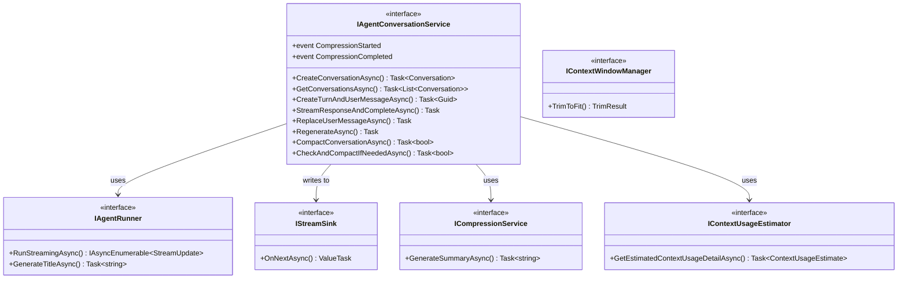
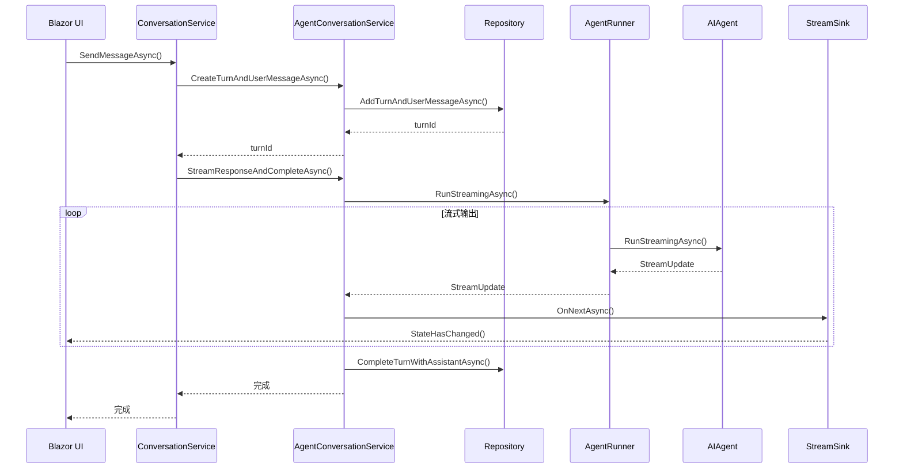
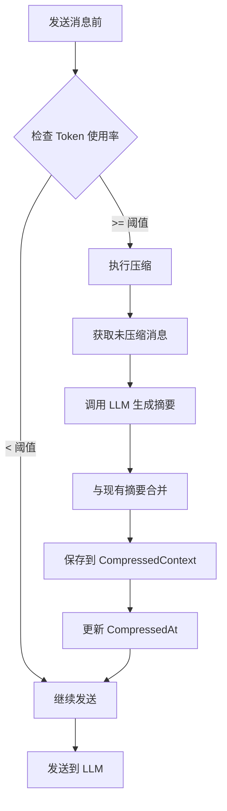

# 应用层 (SmallEBot.Application)

## 1. 层级职责

应用层定义核心业务逻辑接口，协调对话流程：

- **对话服务**: 会话管理和消息发送管道
- **流式接口**: Agent 运行和输出接收
- **上下文管理**: Token 估算和压缩

**设计原则**: 应用层只依赖核心层，定义接口契约。

---

## 2. 核心接口

### 2.1 接口关系图



### 2.2 IAgentConversationService

对话服务接口，编排整个对话流程：

```csharp
public interface IAgentConversationService
{
    // 会话 CRUD
    Task<Conversation> CreateConversationAsync(string userName, CancellationToken ct = default);
    Task<List<Conversation>> GetConversationsAsync(string userName, CancellationToken ct = default);
    Task<Conversation?> GetConversationAsync(Guid id, string userName, CancellationToken ct = default);
    Task<bool> DeleteConversationAsync(Guid id, string userName, CancellationToken ct = default);

    // 消息发送管道
    Task<Guid> CreateTurnAndUserMessageAsync(
        Guid conversationId,
        string userName,
        string userMessage,
        bool useThinking,
        CancellationToken ct = default,
        IReadOnlyList<string>? attachedPaths = null,
        IReadOnlyList<string>? requestedSkillIds = null);

    Task StreamResponseAndCompleteAsync(
        Guid conversationId,
        Guid turnId,
        string userMessage,
        bool useThinking,
        IStreamSink sink,
        CancellationToken ct = default,
        string? commandConfirmationContextId = null,
        IReadOnlyList<string>? attachedPaths = null,
        IReadOnlyList<string>? requestedSkillIds = null);

    // 消息编辑
    Task ReplaceUserMessageAsync(...);
    Task RegenerateAsync(...);

    // 上下文压缩
    Task<bool> CompactConversationAsync(Guid conversationId, CancellationToken ct = default);
    Task<bool> CheckAndCompactIfNeededAsync(Guid conversationId, CancellationToken ct = default);

    // 压缩事件
    event Action<Guid>? CompressionStarted;
    event Action<Guid, bool>? CompressionCompleted;
}
```

### 2.3 IAgentRunner

Agent 运行器接口：

```csharp
public interface IAgentRunner
{
    IAsyncEnumerable<StreamUpdate> RunStreamingAsync(
        Guid conversationId,
        string userMessage,
        bool useThinking,
        CancellationToken cancellationToken = default,
        IReadOnlyList<string>? attachedPaths = null,
        IReadOnlyList<string>? requestedSkillIds = null);

    Task<string> GenerateTitleAsync(string firstMessage, CancellationToken ct = default);
}
```

### 2.4 IStreamSink

流式输出接收接口：

```csharp
public interface IStreamSink
{
    ValueTask OnNextAsync(StreamUpdate update, CancellationToken cancellationToken = default);
}
```

---

## 3. 对话管道

### 3.1 消息发送流程



### 3.2 管道阶段

| 阶段 | 操作 | 说明 |
|------|------|------|
| **1. 创建轮次** | `CreateTurnAndUserMessageAsync` | 持久化用户消息，生成标题 |
| **2. 检查压缩** | `CheckAndCompactIfNeededAsync` | Token 超阈值时压缩 |
| **3. 流式响应** | `StreamResponseAndCompleteAsync` | 调用 Agent 并流式输出 |
| **4. 完成轮次** | `CompleteTurnWithAssistantAsync` | 持久化助手回复 |

### 3.3 上下文压缩流程



---

## 4. 上下文管理

### 4.1 IContextUsageEstimator

估算上下文 Token 使用量：

```csharp
public interface IContextUsageEstimator
{
    Task<ContextUsageEstimate?> GetEstimatedContextUsageDetailAsync(
        Guid conversationId,
        CancellationToken ct = default);
}
```

### 4.2 IContextWindowManager

管理上下文窗口，裁剪过长的历史：

```csharp
public interface IContextWindowManager
{
    TrimResult TrimToFit(
        IReadOnlyList<ChatMessage> messages,
        int maxTokens);
}

public record TrimResult(
    IReadOnlyList<ChatMessage> Messages,
    int RemovedCount,
    int EstimatedTokens);
```

### 4.3 ICompressionService

上下文压缩服务：

```csharp
public interface ICompressionService
{
    Task<string?> GenerateSummaryAsync(
        IReadOnlyList<ChatMessage> messages,
        IReadOnlyList<ToolCall> toolCalls,
        int toolResultMaxLength,
        string? existingSummary,
        CancellationToken ct = default);
}
```

---

## 5. 辅助类型

### 5.1 StreamUpdateToSegments

将流式更新转换为持久化片段：

```csharp
public static class StreamUpdateToSegments
{
    public static List<AssistantSegment> ToSegments(
        IReadOnlyList<StreamUpdate> updates,
        bool useThinking);
}
```

### 5.2 上下文接口

```csharp
// 命令确认上下文
public interface ICommandConfirmationContext
{
    void SetCurrentId(string? id);
    string? GetCurrentId();
}

// 对话任务上下文
public interface IConversationTaskContext
{
    void SetConversationId(Guid? id);
    Guid? GetConversationId();
}
```

---

## 6. 服务实现

### 6.1 AgentConversationService

对话服务的核心实现：

```csharp
public sealed class AgentConversationService : IAgentConversationService
{
    public async Task StreamResponseAndCompleteAsync(...)
    {
        // 1. 设置上下文
        commandConfirmationContext.SetCurrentId(commandConfirmationContextId);
        conversationTaskContext.SetConversationId(conversationId);

        try
        {
            var updates = new List<StreamUpdate>();

            // 2. 流式调用 Agent
            await foreach (var update in agentRunner.RunStreamingAsync(...))
            {
                updates.Add(update);
                await sink.OnNextAsync(update, cancellationToken);
            }

            // 3. 转换并持久化
            var segments = StreamUpdateToSegments.ToSegments(updates, useThinking);
            await repository.CompleteTurnWithAssistantAsync(conversationId, turnId, segments);
        }
        finally
        {
            conversationTaskContext.SetConversationId(null);
        }
    }
}
```

---

## 7. 设计原则

### 7.1 接口分离

- 每个接口只关注一个职责
- 便于测试和模拟

### 7.2 依赖倒置

- 应用层定义接口
- 宿主层提供实现
- 通过 DI 注入

### 7.3 事件驱动

- 通过事件通知 UI 状态变化
- 压缩开始/完成事件
- 解耦 UI 和业务逻辑
