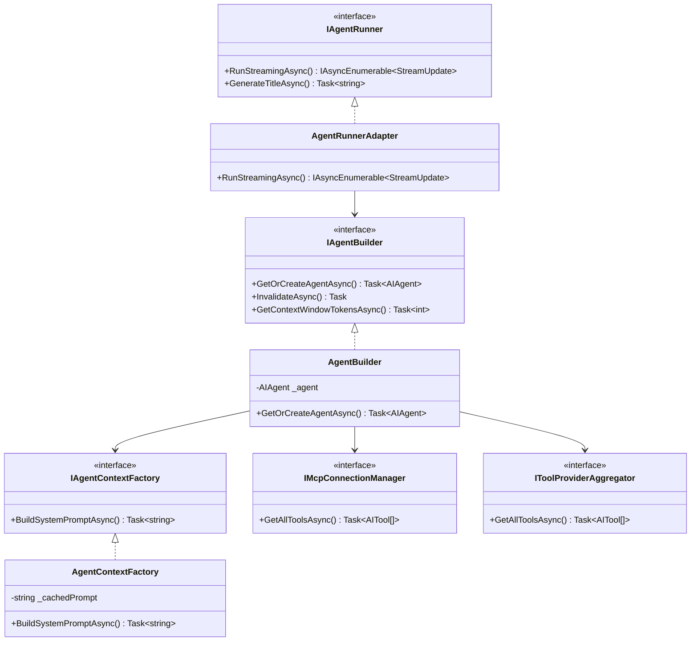
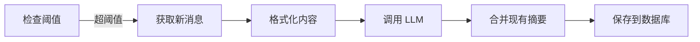
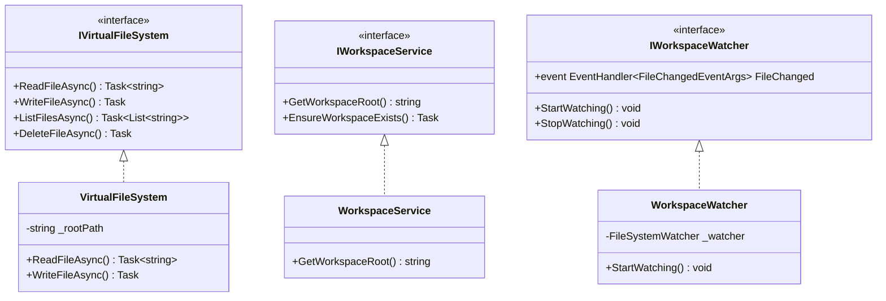

# 宿主服务层 (SmallEBot Host)

## 1. 层级职责

宿主层是应用的入口点和组装层：

- **程序入口**: `Program.cs` 启动配置
- **服务实现**: 实现应用层定义的接口
- **UI 组件**: Blazor Server 组件
- **依赖注入**: 配置所有服务

**设计原则**: 宿主层依赖所有其他层，负责组装和协调。

---

## 2. Agent 服务

### 2.1 服务关系图



### 2.2 AgentBuilder

构建和缓存 AIAgent：

```csharp
public class AgentBuilder : IAgentBuilder
{
    private AIAgent? _agent;
    private AITool[]? _allTools;

    public async Task<AIAgent> GetOrCreateAgentAsync(bool useThinking, CancellationToken ct)
    {
        if (_agent != null)
            return _agent;

        // 1. 构建系统提示词
        var instructions = await contextFactory.BuildSystemPromptAsync(ct);

        // 2. 获取模型配置
        var config = await modelConfig.GetDefaultAsync(ct);

        // 3. 聚合所有工具
        var builtIn = await toolAggregator.GetAllToolsAsync(ct);
        var mcpTools = await mcpConnectionManager.GetAllToolsAsync(ct);
        _allTools = [..builtIn, ..mcpTools];

        // 4. 创建 Anthropic 客户端
        var client = new AnthropicClient(new ClientOptions
        {
            ApiKey = apiKey,
            BaseUrl = config.BaseUrl
        });

        // 5. 构建 AIAgent
        _agent = client.AsAIAgent(
            model: config.Model,
            name: "SmallEBot",
            instructions: instructions,
            tools: _allTools);

        return _agent;
    }

    public Task InvalidateAsync()
    {
        _agent = null;
        _allTools = null;
        return Task.CompletedTask;
    }
}
```

### 2.3 AgentRunnerAdapter

实现 `IAgentRunner`，协调 Agent 执行：

```csharp
public class AgentRunnerAdapter : IAgentRunner
{
    public async IAsyncEnumerable<StreamUpdate> RunStreamingAsync(
        Guid conversationId,
        string userMessage,
        bool useThinking,
        [EnumeratorCancellation] CancellationToken ct = default,
        IReadOnlyList<string>? attachedPaths = null,
        IReadOnlyList<string>? requestedSkillIds = null)
    {
        // 1. 获取 Agent
        var agent = await agentBuilder.GetOrCreateAgentAsync(useThinking, ct);

        // 2. 加载历史消息（过滤已压缩的）
        var history = await LoadFilteredHistoryAsync(conversationId, ct);

        // 3. 构建消息列表
        var messages = BuildMessages(history, userMessage, attachedPaths, requestedSkillIds);

        // 4. 配置推理选项
        var chatOptions = new ChatOptions
        {
            Reasoning = useThinking ? new ReasoningOptions
            {
                Effort = ReasoningEffort.ExtraHigh,
                Output = ReasoningOutput.Full
            } : null
        };

        // 5. 流式执行并转换更新
        await foreach (var update in agent.RunStreamingAsync(messages, null, chatOptions, ct))
        {
            foreach (var content in update.Contents)
            {
                switch (content)
                {
                    case TextContent text:
                        yield return new TextStreamUpdate(text.Text);
                        break;
                    case TextReasoningContent reasoning:
                        yield return new ThinkStreamUpdate(reasoning.Text);
                        break;
                    case FunctionCallContent fnCall:
                        yield return new ToolCallStreamUpdate(...);
                        break;
                    case FunctionResultContent fnResult:
                        yield return new ToolCallStreamUpdate(...);
                        break;
                }
            }
        }
    }
}
```

### 2.4 AgentContextFactory

构建系统提示词：

```csharp
public class AgentContextFactory : IAgentContextFactory
{
    public async Task<string> BuildSystemPromptAsync(CancellationToken ct)
    {
        var sb = new StringBuilder();

        // 1. 基础身份
        sb.AppendLine("You are SmallEBot, a helpful AI assistant.");

        // 2. 技能信息
        var skills = await LoadSkillsAsync(ct);
        if (skills.Count > 0)
        {
            sb.AppendLine("\n## Available Skills");
            foreach (var skill in skills)
                sb.AppendLine($"- /{skill.Id}: {skill.Description}");
        }

        // 3. 上下文压缩摘要
        var compressedContext = await GetCompressedContextAsync(ct);
        if (!string.IsNullOrEmpty(compressedContext))
        {
            sb.AppendLine("\n## Conversation Summary");
            sb.AppendLine(compressedContext);
        }

        _cachedSystemPrompt = sb.ToString();
        return _cachedSystemPrompt;
    }
}
```

---

## 3. 上下文压缩

### 3.1 CompressionService

实现上下文压缩：

```csharp
public class CompressionService : ICompressionService
{
    public async Task<string?> GenerateSummaryAsync(
        IReadOnlyList<ChatMessage> messages,
        IReadOnlyList<ToolCall> toolCalls,
        int toolResultMaxLength,
        string? existingSummary,
        CancellationToken ct)
    {
        // 1. 格式化消息和工具调用
        var formattedContent = FormatMessagesForSummary(messages, toolCalls, toolResultMaxLength);

        // 2. 构建压缩提示词
        var prompt = BuildCompressionPrompt(formattedContent, existingSummary);

        // 3. 调用 LLM 生成摘要
        var summary = await CallLLMForSummaryAsync(prompt, ct);

        return summary;
    }
}
```

### 3.2 压缩流程



---

## 4. MCP 管理

### 4.1 McpConnectionManager

管理 MCP 服务器连接：

```csharp
public class McpConnectionManager : IMcpConnectionManager
{
    private readonly Dictionary<string, IMcpClient> _clients = new();

    public async Task<AITool[]> GetAllToolsAsync(CancellationToken ct)
    {
        var tools = new List<AITool>();

        foreach (var (name, client) in _clients)
        {
            var serverTools = await client.ListToolsAsync(ct);
            tools.AddRange(serverTools);
        }

        return tools.ToArray();
    }

    public async Task ConnectAsync(string name, McpServerConfig config, CancellationToken ct)
    {
        var client = await McpClientFactory.CreateAsync(config, ct);
        _clients[name] = client;
    }
}
```

---

## 5. 工作区服务

### 5.1 服务结构



### 5.2 虚拟文件系统

工作区隔离在 `.agents/vfs/` 目录：

```csharp
public class VirtualFileSystem : IVirtualFileSystem
{
    private readonly string _rootPath;

    public VirtualFileSystem()
    {
        _rootPath = Path.Combine(AppDomain.CurrentDomain.BaseDirectory, ".agents", "vfs");
    }

    public async Task<string> ReadFileAsync(string path, CancellationToken ct)
    {
        var fullPath = GetFullPath(path);
        ValidatePath(fullPath);  // 安全检查
        return await File.ReadAllTextAsync(fullPath, ct);
    }

    private string GetFullPath(string relativePath)
        => Path.GetFullPath(Path.Combine(_rootPath, relativePath));

    private void ValidatePath(string fullPath)
    {
        if (!fullPath.StartsWith(_rootPath, StringComparison.OrdinalIgnoreCase))
            throw new UnauthorizedAccessException("Path outside workspace");
    }
}
```

---

## 6. 终端服务

### 6.1 命令执行

```csharp
public class CommandRunner : ICommandRunner
{
    public async Task<CommandResult> RunAsync(string command, string workingDirectory, CancellationToken ct)
    {
        var psi = new ProcessStartInfo
        {
            FileName = "cmd.exe",  // Windows
            Arguments = $"/c {command}",
            WorkingDirectory = workingDirectory,
            RedirectStandardOutput = true,
            RedirectStandardError = true
        };

        using var process = Process.Start(psi);
        var output = await process.StandardOutput.ReadToEndAsync(ct);
        var error = await process.StandardError.ReadToEndAsync(ct);

        await process.WaitForExitAsync(ct);

        return new CommandResult(process.ExitCode, output, error);
    }
}
```

### 6.2 命令确认

危险命令需要用户确认：

```csharp
public class CommandConfirmationService : ICommandConfirmationService
{
    public event EventHandler<PendingRequestEventArgs>? ConfirmationRequested;

    public async Task<CommandConfirmResult> WaitForConfirmationAsync(
        string command,
        string contextId,
        CancellationToken ct)
    {
        var tcs = new TaskCompletionSource<CommandConfirmResult>();

        // 触发确认事件
        ConfirmationRequested?.Invoke(this, new PendingRequestEventArgs(command, contextId, tcs));

        // 等待用户响应
        return await tcs.Task.WaitAsync(ct);
    }
}
```

---

## 7. Circuit 管理

### 7.1 当前 Circuit 访问器

```csharp
public interface ICurrentCircuitAccessor
{
    string? GetCurrentCircuitId();
}

public class CurrentCircuitAccessor : ICurrentCircuitAccessor
{
    private readonly AsyncLocal<string?> _currentCircuitId = new();

    public string? GetCurrentCircuitId() => _currentCircuitId.Value;
    public void SetCurrentCircuitId(string? id) => _currentCircuitId.Value = id;
}
```

### 7.2 Circuit 上下文处理器

```csharp
public class CircuitContextHandler : CircuitHandler
{
    public override Task OnCircuitOpenedAsync(Circuit circuit, CancellationToken ct)
    {
        // Circuit 打开时记录
        return base.OnCircuitOpenedAsync(circuit, ct);
    }

    public override Task OnCircuitClosedAsync(Circuit circuit, CancellationToken ct)
    {
        // Circuit 关闭时清理
        return base.OnCircuitClosedAsync(circuit, ct);
    }
}
```

---

## 8. 其他服务

### 8.1 用户偏好服务

```csharp
public class UserPreferencesService
{
    private readonly string _settingsPath = "smallebot-settings.json";

    public async Task<UserPreferences> LoadAsync()
    {
        if (!File.Exists(_settingsPath))
            return new UserPreferences();

        var json = await File.ReadAllTextAsync(_settingsPath);
        return JsonSerializer.Deserialize<UserPreferences>(json) ?? new();
    }

    public async Task SaveAsync(UserPreferences preferences)
    {
        var json = JsonSerializer.Serialize(preferences, new JsonSerializerOptions { WriteIndented = true });
        await File.WriteAllTextAsync(_settingsPath, json);
    }
}
```

### 8.2 Markdown 服务

```csharp
public class MarkdownService
{
    public string RenderToHtml(string markdown)
    {
        // 使用 Markdig 渲染 Markdown
        var pipeline = new MarkdownPipelineBuilder()
            .UseAdvancedExtensions()
            .Build();
        return Markdown.ToHtml(markdown, pipeline);
    }
}
```
