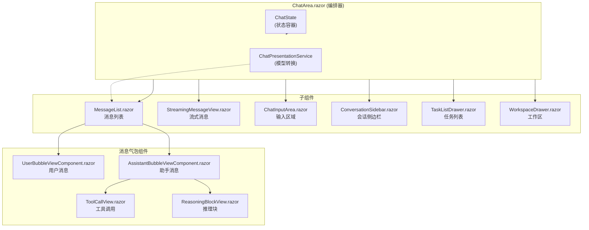
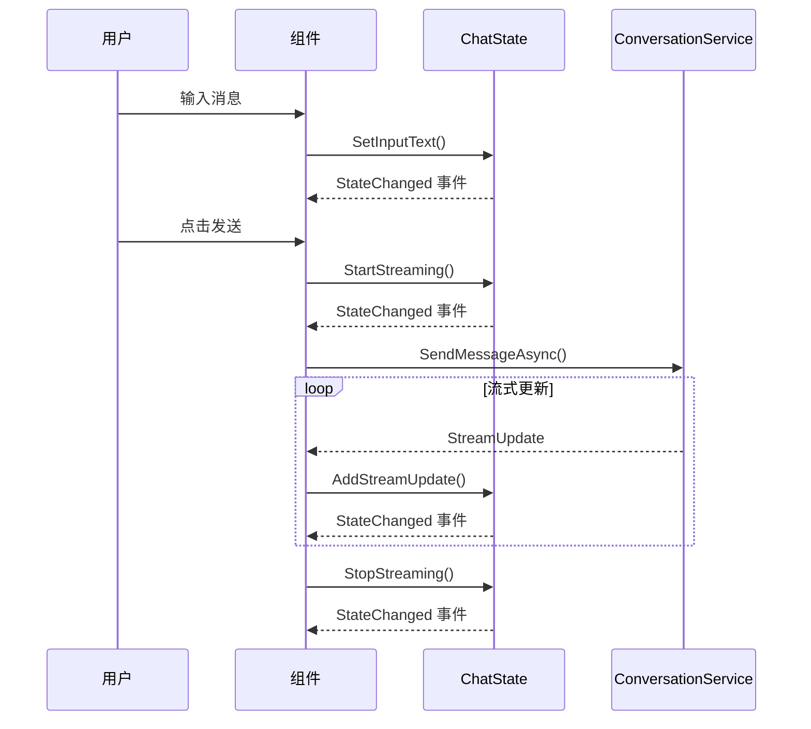
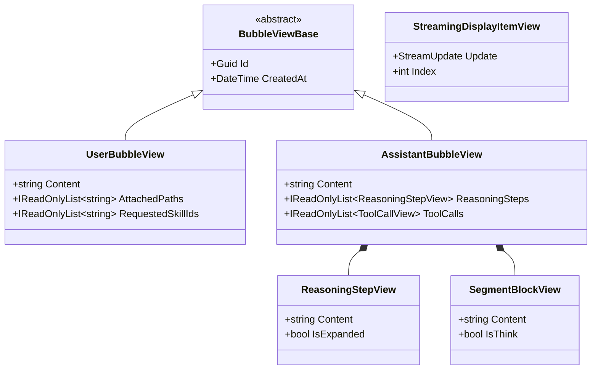
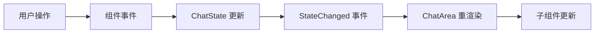

# 聊天 UI 架构

## 1. 架构概述

聊天 UI 采用 **状态容器 + 事件** 模式，实现关注点分离：

- **ChatArea**: 主编排组件，协调所有子组件
- **ChatState**: 状态容器，管理所有 UI 状态
- **ChatPresentationService**: 模型转换服务
- **子组件**: 各自负责特定功能

---

## 2. 组件结构

### 2.1 组件层次图



### 2.2 组件职责

| 组件 | 职责 |
|------|------|
| `ChatArea.razor` | 主编排器，协调状态和事件 |
| `MessageList.razor` | 渲染历史消息列表 |
| `StreamingMessageView.razor` | 渲染流式输出 |
| `ChatInputArea.razor` | 输入框和附件管理 |
| `ChatInputBar.razor` | 底部输入栏 |
| `ConversationSidebar.razor` | 会话列表 |
| `StreamingIndicator.razor` | 流式输出指示器 |
| `ToolCallView.razor` | 工具调用展示 |
| `ReasoningBlockView.razor` | 推理/思考块展示 |

---

## 3. 状态管理

### 3.1 ChatState 状态容器

```csharp
public sealed class ChatState : IDisposable
{
    // === 消息状态 ===
    public IReadOnlyList<ChatBubble> Bubbles { get; private set; } = [];
    public Guid? ConversationId { get; private set; }

    // === 输入状态 ===
    public string InputText { get; private set; } = "";
    public IReadOnlyList<AttachmentItem> Attachments { get; private set; } = [];
    public IReadOnlyList<string> RequestedSkillIds { get; private set; } = [];

    // === 流式状态 ===
    public bool IsStreaming { get; private set; }
    public DateTime? StreamingStartedAt { get; private set; }
    public string StreamingText { get; private set; } = "";
    public IReadOnlyList<StreamUpdate> StreamingUpdates { get; private set; } = [];

    // === UI 状态 ===
    public bool PopoverOpen { get; private set; }
    public string ContextPercentText { get; private set; } = "0%";

    // === 事件 ===
    public event Action? StateChanged;
    public event Func<Task>? MessageSent;

    // === 状态更新方法 ===
    public void SetBubbles(IReadOnlyList<ChatBubble> bubbles) { ... }
    public void SetConversationId(Guid? id) { ... }
    public void SetInputText(string text) { ... }
    public void AddAttachment(AttachmentItem item) { ... }
    public void StartStreaming() { ... }
    public void StopStreaming() { ... }
    public void AddStreamUpdate(StreamUpdate update) { ... }

    private void NotifyStateChanged() => StateChanged?.Invoke();
}
```

### 3.2 状态更新流程



---

## 4. 视图模型

### 4.1 视图模型层次



### 4.2 视图模型定义

```csharp
// 气泡基类
public abstract class BubbleViewBase
{
    public Guid Id { get; init; }
    public DateTime CreatedAt { get; init; }
}

// 用户消息气泡
public class UserBubbleView : BubbleViewBase
{
    public string Content { get; init; } = "";
    public IReadOnlyList<string> AttachedPaths { get; init; } = [];
    public IReadOnlyList<string> RequestedSkillIds { get; init; } = [];
}

// 助手消息气泡
public class AssistantBubbleView : BubbleViewBase
{
    public string Content { get; init; } = "";
    public IReadOnlyList<ReasoningStepView> ReasoningSteps { get; init; } = [];
    public IReadOnlyList<SegmentBlockView> Segments { get; init; } = [];
}

// 推理步骤
public class ReasoningStepView
{
    public Guid Id { get; init; }
    public string Content { get; init; } = "";
    public bool IsExpanded { get; set; }
}

// 片段块
public class SegmentBlockView
{
    public string Content { get; init; } = "";
    public bool IsThink { get; init; }
}
```

---

## 5. ChatPresentationService

### 5.1 模型转换

将领域模型转换为视图模型：

```csharp
public class ChatPresentationService
{
    public List<BubbleViewBase> ConvertToBubbleViews(
        IReadOnlyList<ChatBubble> bubbles)
    {
        var result = new List<BubbleViewBase>();

        foreach (var bubble in bubbles)
        {
            if (bubble.IsUser)
            {
                result.Add(new UserBubbleView
                {
                    Id = bubble.Id,
                    CreatedAt = bubble.CreatedAt,
                    Content = bubble.Content,
                    AttachedPaths = bubble.AttachedPaths ?? [],
                    RequestedSkillIds = bubble.RequestedSkillIds ?? []
                });
            }
            else
            {
                result.Add(ConvertAssistantBubble(bubble));
            }
        }

        return result;
    }

    private AssistantBubbleView ConvertAssistantBubble(ChatBubble bubble)
    {
        return new AssistantBubbleView
        {
            Id = bubble.Id,
            CreatedAt = bubble.CreatedAt,
            Content = bubble.Content,
            ReasoningSteps = ConvertReasoningSteps(bubble.ThinkBlocks),
            Segments = ConvertSegments(bubble.ToolCalls)
        };
    }
}
```

---

## 6. 关键组件实现

### 6.1 ChatArea.razor

主编排组件：

```razor
@inject ChatState State
@inject ConversationService ConversationService
@implements IDisposable

<div class="chat-container">
    <ConversationSidebar @bind-ConversationId="State.ConversationId" />

    <div class="chat-main">
        <MessageList Bubbles="_bubbleViews" />
        @if (State.IsStreaming)
        {
            <StreamingMessageView Updates="State.StreamingUpdates" />
        }
        <ChatInputArea OnSend="HandleSend" />
    </div>

    <WorkspaceDrawer />
    <TaskListDrawer />
</div>

@code {
    private List<BubbleViewBase> _bubbleViews = [];

    protected override void OnInitialized()
    {
        State.StateChanged += StateChangedHandler;
    }

    private async Task HandleSend()
    {
        await ConversationService.SendMessageAsync(
            State.ConversationId!.Value,
            State.InputText,
            State.Attachments,
            State.RequestedSkillIds);
    }

    private void StateChangedHandler()
    {
        _bubbleViews = _presentationService.ConvertToBubbleViews(State.Bubbles);
        InvokeAsync(StateHasChanged);
    }

    public void Dispose()
    {
        State.StateChanged -= StateChangedHandler;
    }
}
```

### 6.2 MessageList.razor

消息列表渲染：

```razor
<div class="message-list">
    @foreach (var bubble in Bubbles)
    {
        @if (bubble is UserBubbleView userBubble)
        {
            <UserBubbleViewComponent Bubble="userBubble" />
        }
        else if (bubble is AssistantBubbleView assistantBubble)
        {
            <AssistantBubbleViewComponent Bubble="assistantBubble" />
        }
    }
</div>

@code {
    [Parameter]
    public IReadOnlyList<BubbleViewBase> Bubbles { get; set; } = [];
}
```

### 6.3 StreamingMessageView.razor

流式消息渲染：

```razor
<div class="streaming-message">
    @foreach (var update in Updates)
    {
        @switch (update)
        {
            case TextStreamUpdate text:
                <span class="text">@text.Text</span>
            case ThinkStreamUpdate think:
                <div class="think">@think.Text</div>
            case ToolCallStreamUpdate tool:
                <ToolCallView Update="tool" />
        }
    }
    <span class="cursor">|</span>
</div>
```

---

## 7. 事件处理

### 7.1 事件流



### 7.2 关键事件

| 事件 | 触发时机 | 处理方式 |
|------|----------|----------|
| `StateChanged` | 状态变更 | 触发组件重渲染 |
| `MessageSent` | 消息发送完成 | 刷新消息列表 |
| `BeforeSend` | 消息发送前 | 执行压缩检查 |

---

## 8. 样式和主题

### 8.1 MudBlazor 集成

使用 MudBlazor 组件库：

```razor
<MudDrawer>
    <MudList>
        <MudListItem>会话项</MudListItem>
    </MudList>
</MudDrawer>

<MudCard>
    <MudCardContent>消息内容</MudCardContent>
</MudCard>
```

### 8.2 主题切换

支持亮色/暗色主题：

```csharp
public class ThemeConstants
{
    public static readonly MudTheme LightTheme = new() { ... };
    public static readonly MudTheme DarkTheme = new() { ... };
}
```

---

## 9. 性能优化

### 9.1 虚拟化

长列表使用虚拟滚动：

```razor
<MudVirtualize Items="Bubbles" Context="bubble">
    <UserBubbleViewComponent Bubble="bubble" />
</MudVirtualize>
```

### 9.2 防抖

输入框使用防抖：

```csharp
private Debouncer _debouncer = new(TimeSpan.FromMilliseconds(300));

private void OnInputChanged(string value)
{
    _debouncer.Debounce(() => State.SetInputText(value));
}
```

### 9.3 异步渲染

流式更新使用异步渲染：

```csharp
private async Task OnStreamUpdate(StreamUpdate update)
{
    State.AddStreamUpdate(update);
    await InvokeAsync(StateHasChanged);
}
```
