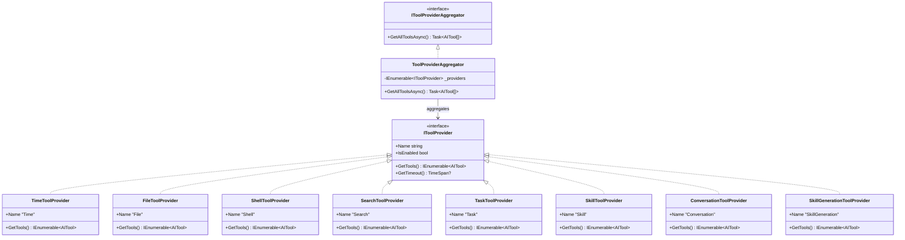
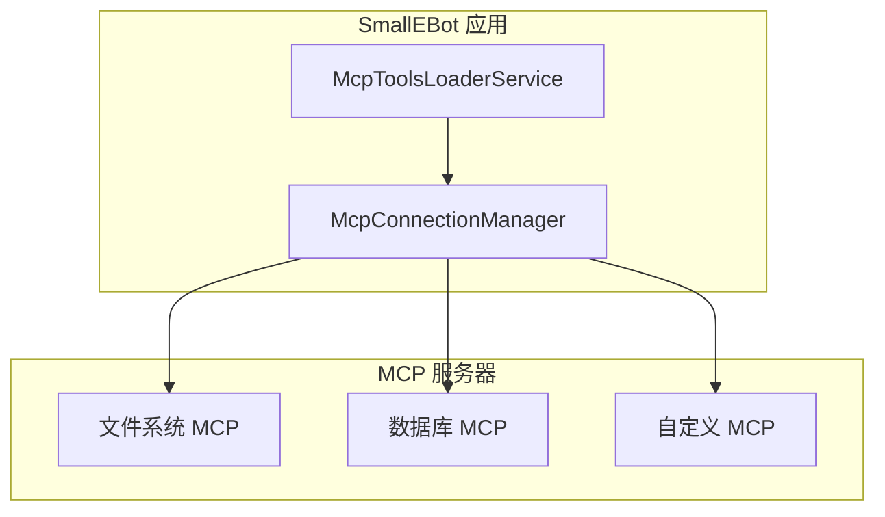
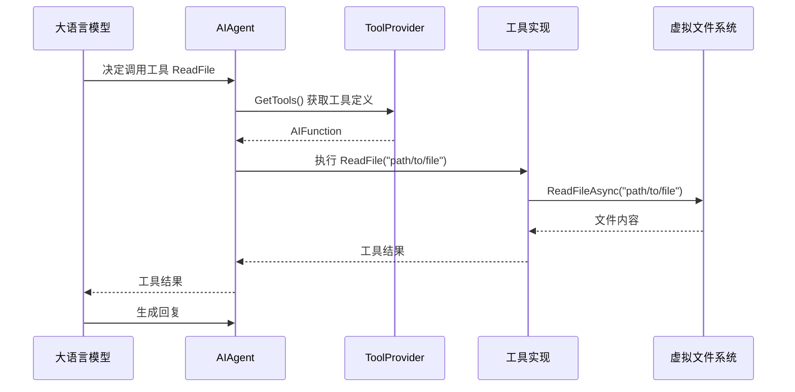
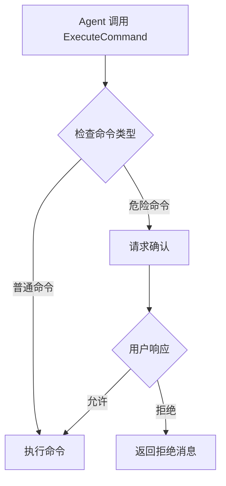

# 工具系统

## 1. 系统概述

SmallEBot 的工具系统采用 **提供者模式**，支持三类工具来源：

- **内置工具**: 文件、终端、搜索、任务等
- **MCP 工具**: 通过 Model Context Protocol 连接的外部工具
- **技能工具**: 用户定义的自定义技能

---

## 2. 接口设计

### 2.1 IToolProvider

工具提供者接口：

```csharp
public interface IToolProvider
{
    /// <summary>提供者名称，用于标识</summary>
    string Name { get; }

    /// <summary>是否启用</summary>
    bool IsEnabled { get; }

    /// <summary>获取所有工具</summary>
    IEnumerable<AITool> GetTools();

    /// <summary>获取特定工具的超时时间</summary>
    TimeSpan? GetTimeout(string toolName) => null;
}
```

### 2.2 工具聚合器

```csharp
public interface IToolProviderAggregator
{
    Task<AITool[]> GetAllToolsAsync(CancellationToken ct = default);
}
```

### 2.3 类关系图



---

## 3. 内置工具

### 3.1 TimeToolProvider

提供时间相关工具：

| 工具名 | 功能 |
|--------|------|
| `GetCurrentTime` | 获取当前本地时间 |

```csharp
public class TimeToolProvider : IToolProvider
{
    public string Name => "Time";
    public bool IsEnabled => true;

    public IEnumerable<AITool> GetTools()
    {
        yield return AIFunctionFactory.Create(
            () => DateTime.Now.ToString("yyyy-MM-dd HH:mm:ss"),
            name: "GetCurrentTime",
            description: "Get current local date and time");
    }
}
```

### 3.2 FileToolProvider

提供文件操作工具：

| 工具名 | 功能 |
|--------|------|
| `GetWorkspaceRoot` | 获取工作区根路径 |
| `ReadFile` | 读取文件内容 |
| `WriteFile` | 写入文件 |
| `AppendFile` | 追加文件 |
| `ListFiles` | 列出目录文件 |
| `CopyDirectory` | 复制目录 |
| `DeleteFile` | 删除文件 |

```csharp
public class FileToolProvider : IToolProvider
{
    public string Name => "File";
    public bool IsEnabled => true;

    public IEnumerable<AITool> GetTools()
    {
        yield return AIFunctionFactory.Create(
            (string path) => _vfs.ReadFileAsync(path),
            name: "ReadFile",
            description: "Read file content from workspace");

        yield return AIFunctionFactory.Create(
            (string path, string content) => _vfs.WriteFileAsync(path, content),
            name: "WriteFile",
            description: "Write content to file in workspace");

        // ... 更多工具
    }
}
```

### 3.3 ShellToolProvider

提供终端命令执行：

| 工具名 | 功能 |
|--------|------|
| `ExecuteCommand` | 执行终端命令 |

```csharp
public class ShellToolProvider : IToolProvider
{
    public string Name => "Shell";
    public bool IsEnabled => true;

    public IEnumerable<AITool> GetTools()
    {
        yield return AIFunctionFactory.Create(
            async (string command) =>
            {
                var result = await _commandRunner.RunAsync(command, _workspaceRoot);
                return result.Output;
            },
            name: "ExecuteCommand",
            description: "Execute a shell command");
    }

    public TimeSpan? GetTimeout(string toolName)
        => TimeSpan.FromMinutes(5);  // 终端命令较长超时
}
```

### 3.4 SearchToolProvider

提供搜索功能：

| 工具名 | 功能 |
|--------|------|
| `GrepFiles` | 按文件名搜索 |
| `GrepContent` | 按内容搜索 |

### 3.5 TaskToolProvider

提供任务管理：

| 工具名 | 功能 |
|--------|------|
| `SetTaskList` | 设置任务列表 |
| `ListTasks` | 获取任务列表 |
| `CompleteTask` | 完成任务 |
| `ClearTasks` | 清空任务 |

### 3.6 SkillToolProvider

提供技能读取：

| 工具名 | 功能 |
|--------|------|
| `ReadSkill` | 读取技能内容 |
| `ReadSkillFile` | 读取技能文件 |
| `ListSkillFiles` | 列出技能文件 |

### 3.7 ConversationToolProvider

提供对话信息：

| 工具名 | 功能 |
|--------|------|
| `ReadConversationData` | 读取当前对话时间线 |

### 3.8 SkillGenerationToolProvider

提供技能生成：

| 工具名 | 功能 |
|--------|------|
| `GenerateSkill` | 从模式生成技能 |

---

## 4. MCP 工具

### 4.1 MCP 架构



### 4.2 McpConnectionManager

```csharp
public class McpConnectionManager : IMcpConnectionManager
{
    private readonly Dictionary<string, IMcpClient> _clients = new();

    public async Task InitializeAsync(CancellationToken ct)
    {
        var config = await _configService.LoadConfigAsync(ct);

        foreach (var (name, serverConfig) in config.McpServers)
        {
            var client = await McpClientFactory.CreateAsync(serverConfig, ct);
            _clients[name] = client;
        }
    }

    public async Task<AITool[]> GetAllToolsAsync(CancellationToken ct)
    {
        var tools = new List<AITool>();

        foreach (var client in _clients.Values)
        {
            var serverTools = await client.ListToolsAsync(ct);
            tools.AddRange(serverTools);
        }

        return tools.ToArray();
    }
}
```

### 4.3 MCP 配置

配置文件 `.agents/.mcp.json`:

```json
{
  "mcpServers": {
    "filesystem": {
      "command": "npx",
      "args": ["-y", "@modelcontextprotocol/server-filesystem", "/path/to/dir"]
    },
    "postgres": {
      "command": "npx",
      "args": ["-y", "@modelcontextprotocol/server-postgres"],
      "env": {
        "DATABASE_URL": "postgresql://..."
      }
    }
  }
}
```

---

## 5. 技能系统

### 5.1 技能结构

技能是 Markdown 文件，包含 frontmatter：

```markdown
---
name: my-skill
description: A useful skill
trigger: /my-skill
---

# My Skill

Detailed instructions for the AI...
```

### 5.2 技能目录

| 目录 | 用途 |
|------|------|
| `.agents/vfs/sys.skills/` | 系统技能（只读） |
| `.agents/vfs/skills/` | 用户技能 |

### 5.3 SkillFrontmatterParser

```csharp
public class SkillFrontmatterParser
{
    public SkillMetadata? Parse(string content)
    {
        var frontmatterMatch = Regex.Match(content, @"^---\s*\n(.*?)\n---\s*\n", RegexOptions.Singleline);
        if (!frontmatterMatch.Success)
            return null;

        var yaml = frontmatterMatch.Groups[1].Value;
        return DeserializeYaml<SkillMetadata>(yaml);
    }
}
```

### 5.4 技能引用

用户通过 `/skillId` 语法引用技能：

```
请帮我实现这个功能 /my-skill
```

系统会：
1. 解析 `/my-skill` 为技能 ID
2. 调用 `ReadSkill("my-skill")` 获取内容
3. 将技能内容注入到上下文

---

## 6. 工具执行流程

### 6.1 流程图



### 6.2 命令确认流程

危险命令需要用户确认：



---

## 7. 工具注册

### 7.1 DI 注册

```csharp
// ServiceCollectionExtensions.cs
services.AddSingleton<IToolProvider, TimeToolProvider>();
services.AddSingleton<IToolProvider, FileToolProvider>();
services.AddSingleton<IToolProvider, SearchToolProvider>();
services.AddSingleton<IToolProvider, ShellToolProvider>();
services.AddSingleton<IToolProvider, TaskToolProvider>();
services.AddSingleton<IToolProvider, SkillToolProvider>();
services.AddScoped<IToolProvider, ConversationToolProvider>();
services.AddScoped<IToolProvider, SkillGenerationToolProvider>();

services.AddScoped<IToolProviderAggregator, ToolProviderAggregator>();
```

### 7.2 工具聚合

```csharp
public class ToolProviderAggregator : IToolProviderAggregator
{
    private readonly IEnumerable<IToolProvider> _providers;

    public ToolProviderAggregator(IEnumerable<IToolProvider> providers)
    {
        _providers = providers;
    }

    public async Task<AITool[]> GetAllToolsAsync(CancellationToken ct)
    {
        var tools = new List<AITool>();

        foreach (var provider in _providers.Where(p => p.IsEnabled))
        {
            tools.AddRange(provider.GetTools());
        }

        return tools.ToArray();
    }
}
```

---

## 8. 扩展指南

### 8.1 添加新工具提供者

1. 创建类实现 `IToolProvider`:

```csharp
public class MyCustomToolProvider : IToolProvider
{
    public string Name => "MyCustom";
    public bool IsEnabled => true;

    public IEnumerable<AITool> GetTools()
    {
        yield return AIFunctionFactory.Create(
            (string input) => DoSomething(input),
            name: "MyCustomTool",
            description: "Does something custom");
    }
}
```

2. 注册到 DI:

```csharp
services.AddSingleton<IToolProvider, MyCustomToolProvider>();
```

### 8.2 添加 MCP 服务器

编辑 `.agents/.mcp.json`:

```json
{
  "mcpServers": {
    "my-server": {
      "command": "node",
      "args": ["path/to/my-server.js"]
    }
  }
}
```

然后调用 `AgentCacheService.InvalidateAgentAsync()` 重新加载。
