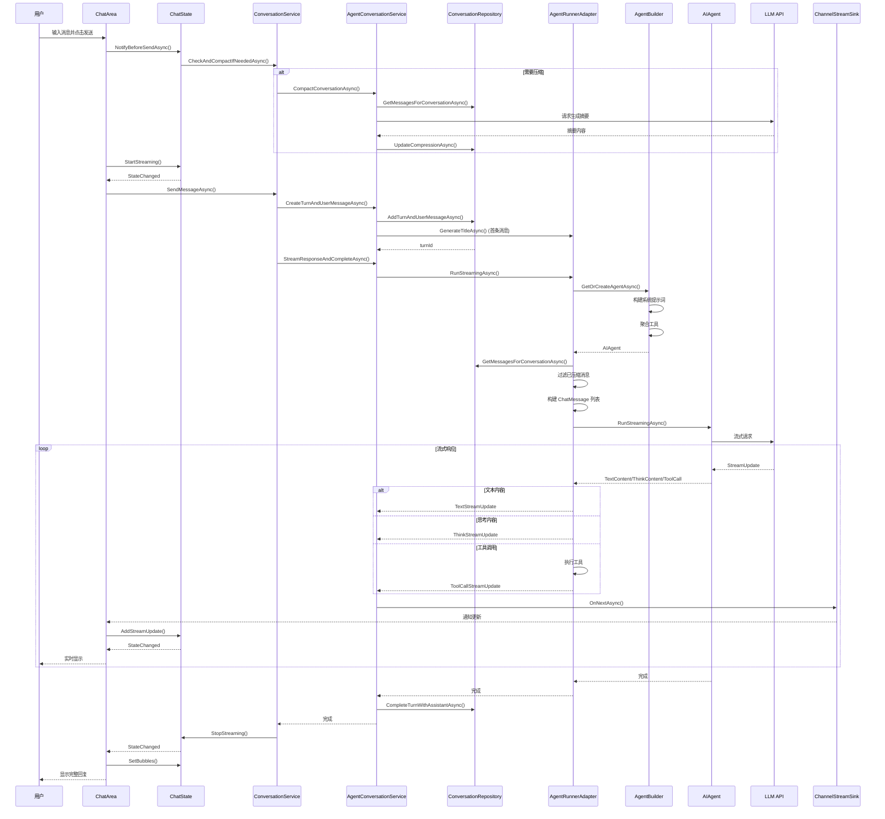
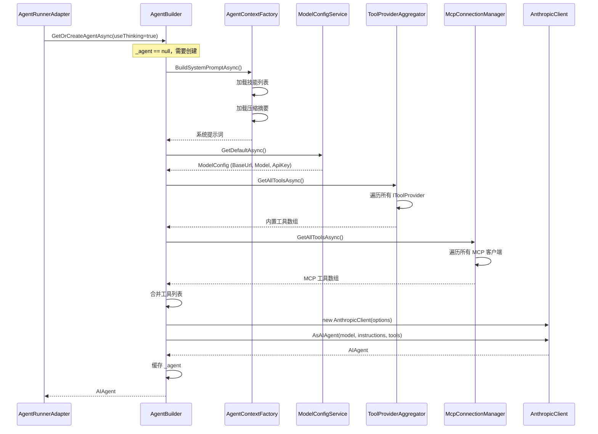
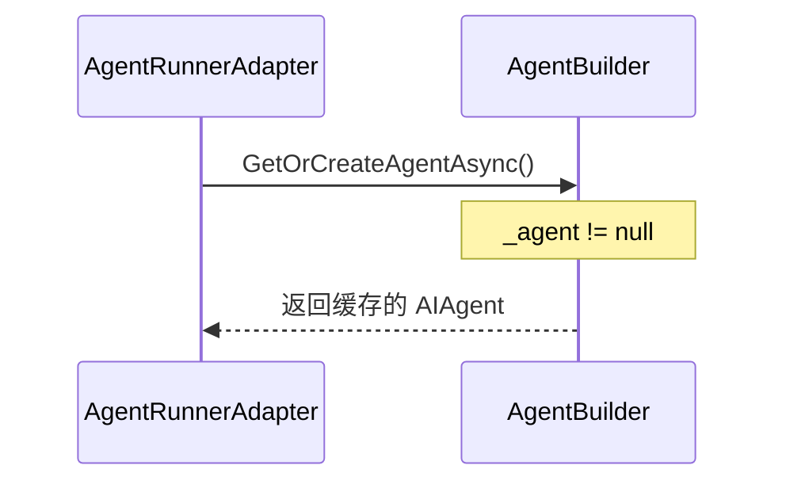
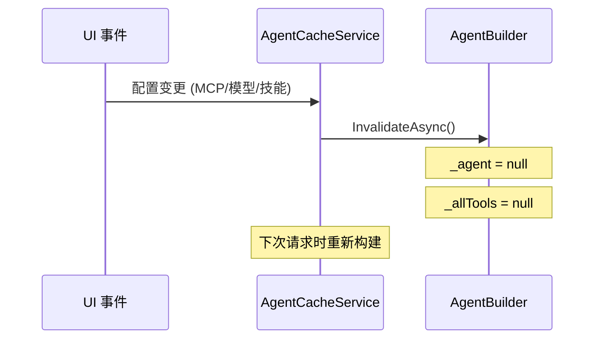
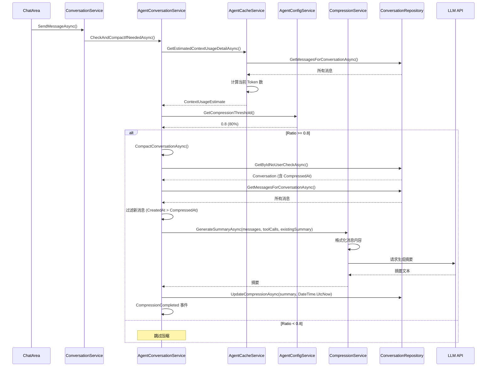
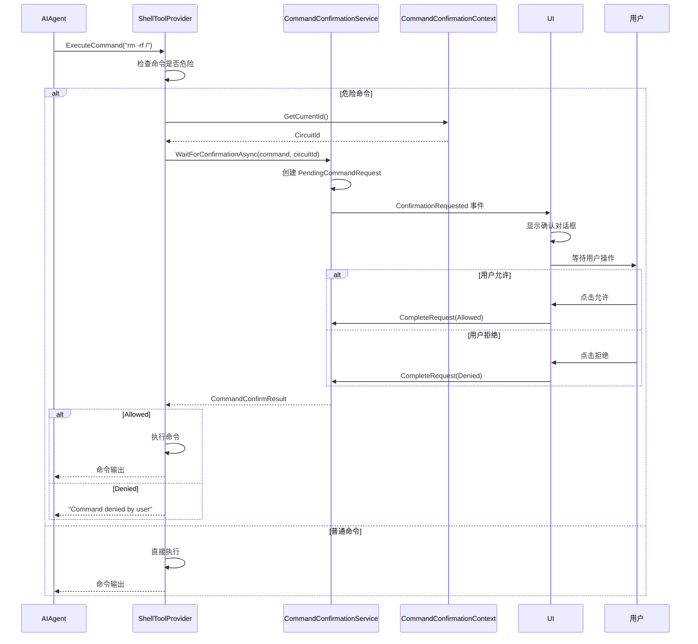
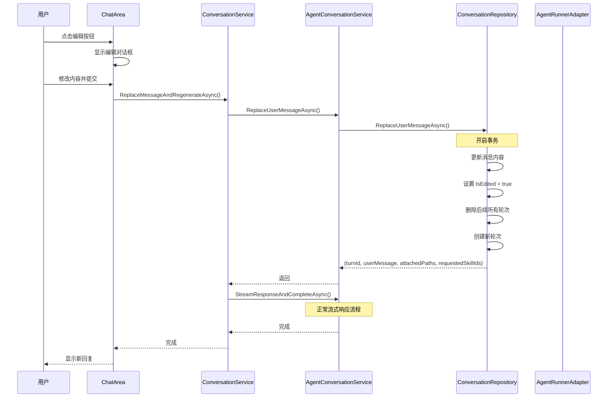
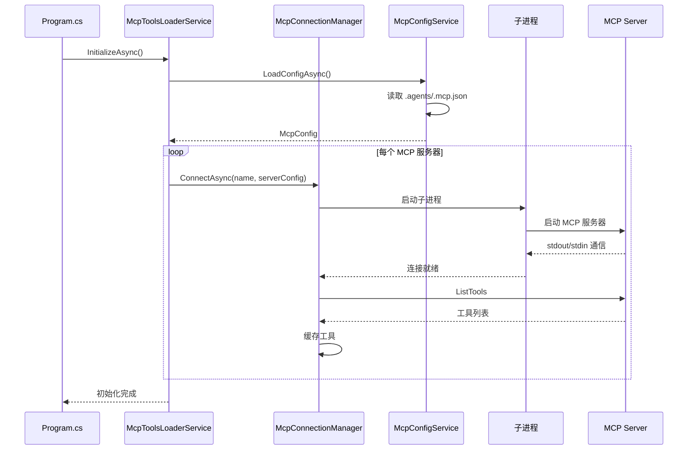
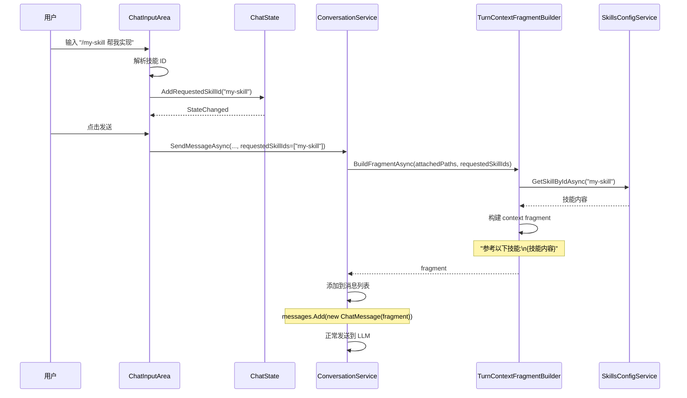
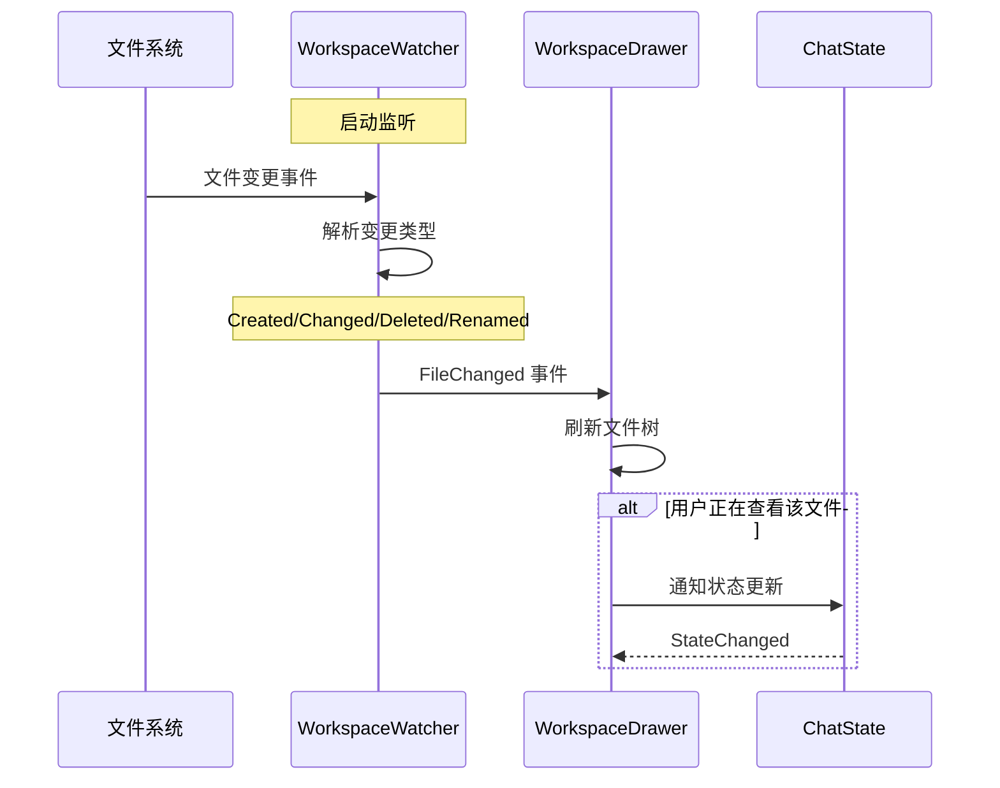

# 时序图

## 1. 消息发送完整流程

### 1.1 正常发送消息

---

## 2. Agent 构建流程

### 2.1 首次创建 Agent

### 2.2 缓存命中

### 2.3 缓存失效

---

## 3. 上下文压缩流程

### 3.1 自动压缩检查

---

## 4. 命令确认流程

### 4.1 危险命令确认

---

## 5. 消息编辑流程

### 5.1 编辑用户消息并重新生成

---

## 6. MCP 连接初始化

### 6.1 启动时连接 MCP 服务器

---

## 7. 技能注入流程

### 7.1 用户引用技能

---

## 8. 工作区文件变更监听

### 8.1 文件变更通知

