# 类图

## 1. 核心实体类图

### 1.1 会话聚合

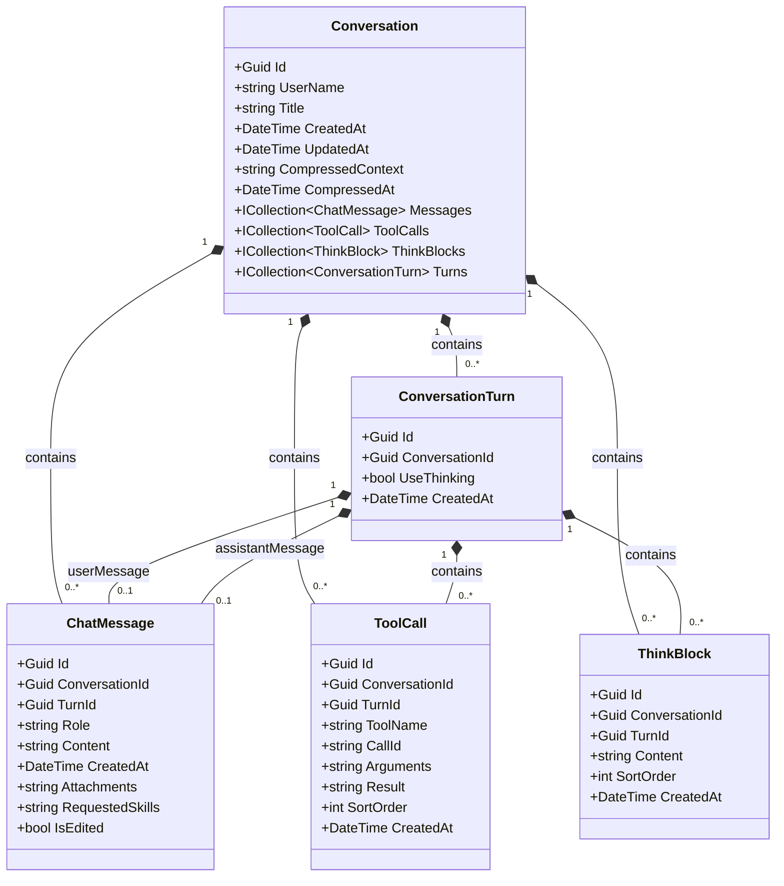

---

## 2. 流式更新类图

### 2.1 StreamUpdate 层次

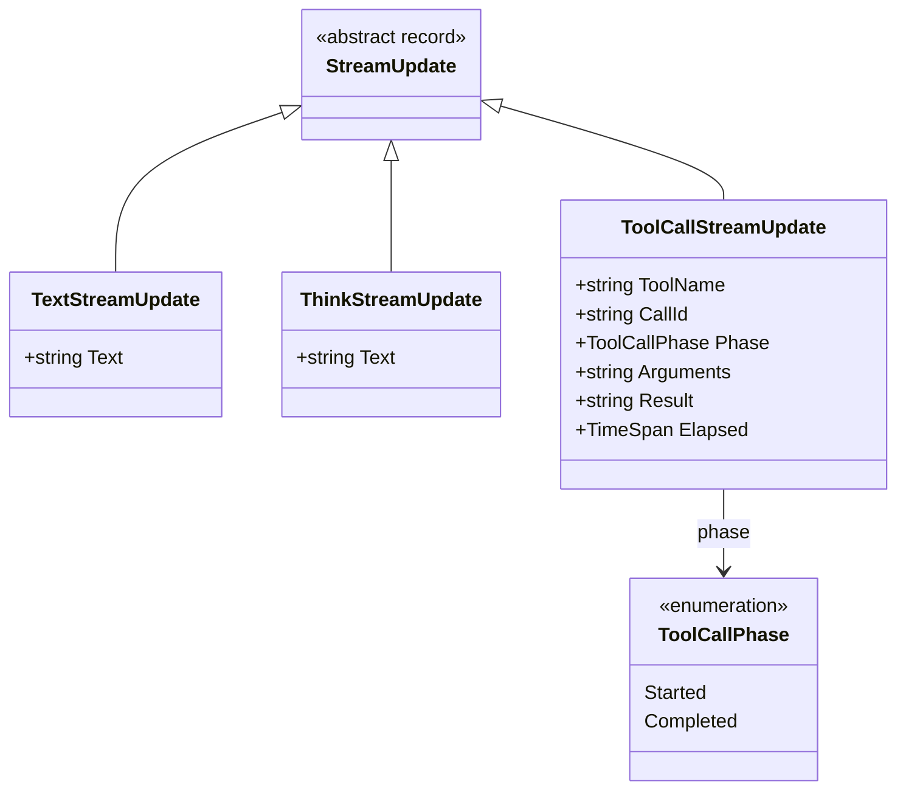

### 2.2 模型类

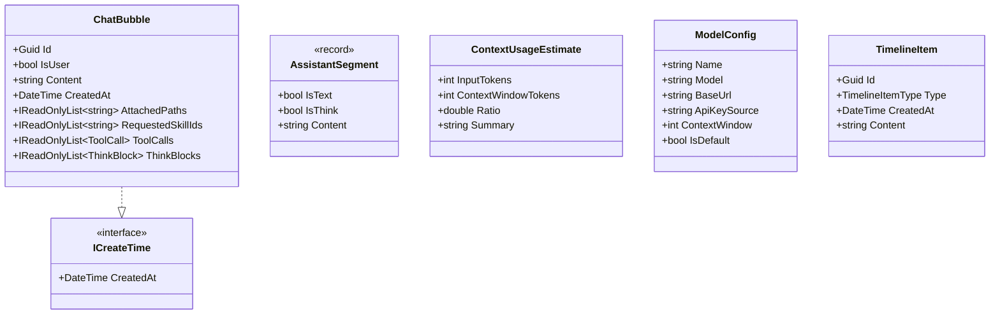

---

## 3. 应用层接口类图

### 3.1 核心接口

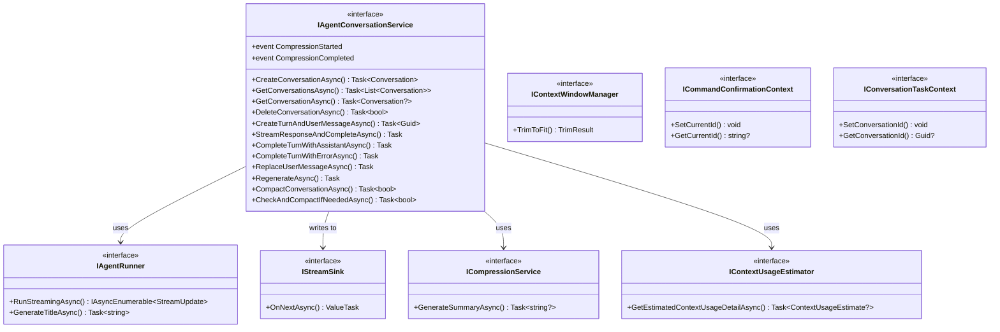

---

## 4. Agent 服务类图

### 4.1 Agent 构建与运行

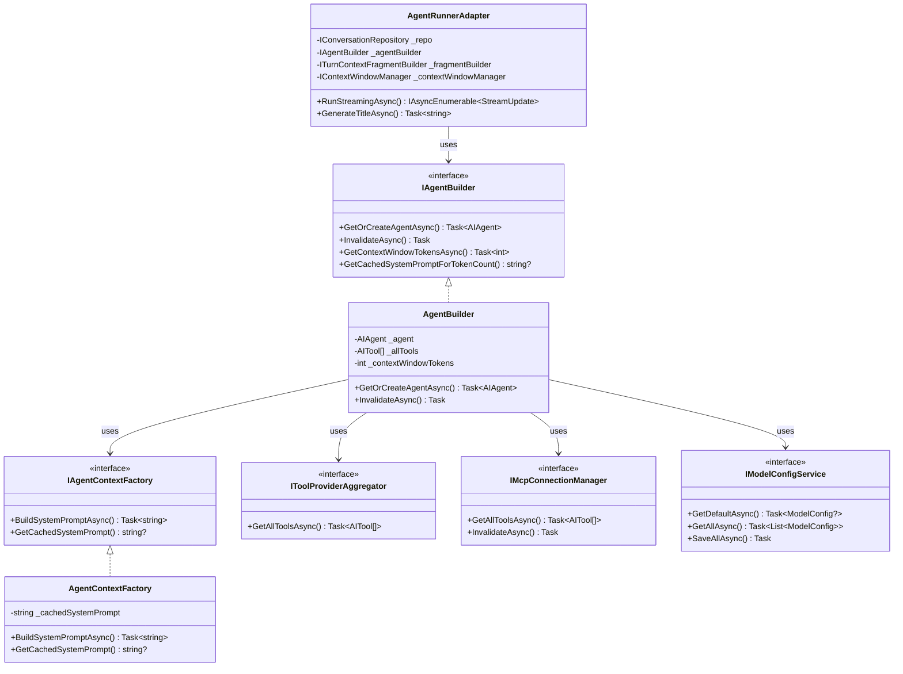

---

## 5. 工具系统类图

### 5.1 工具提供者

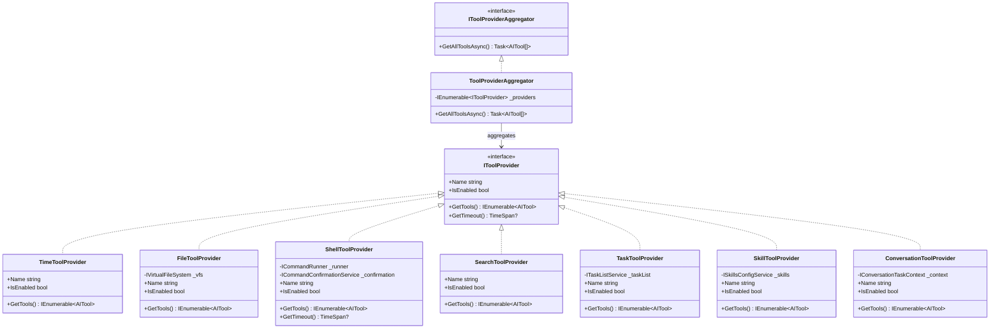

---

## 6. 仓储类图

### 6.1 仓储接口与实现

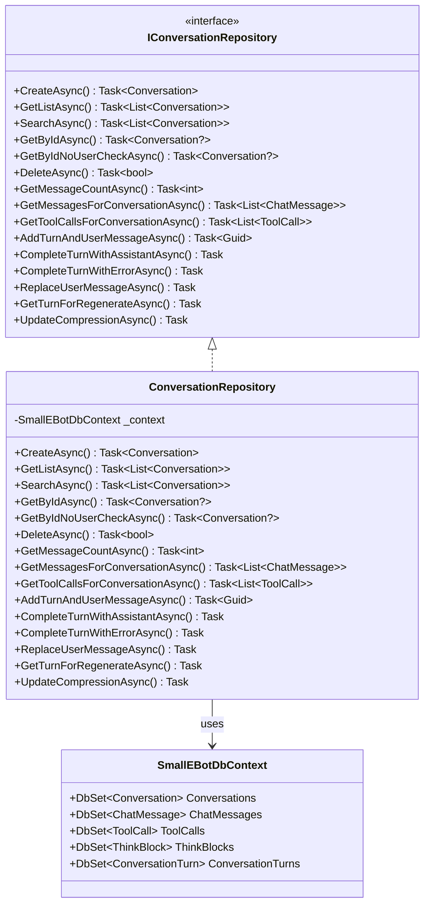

---

## 7. 工作区类图

### 7.1 虚拟文件系统

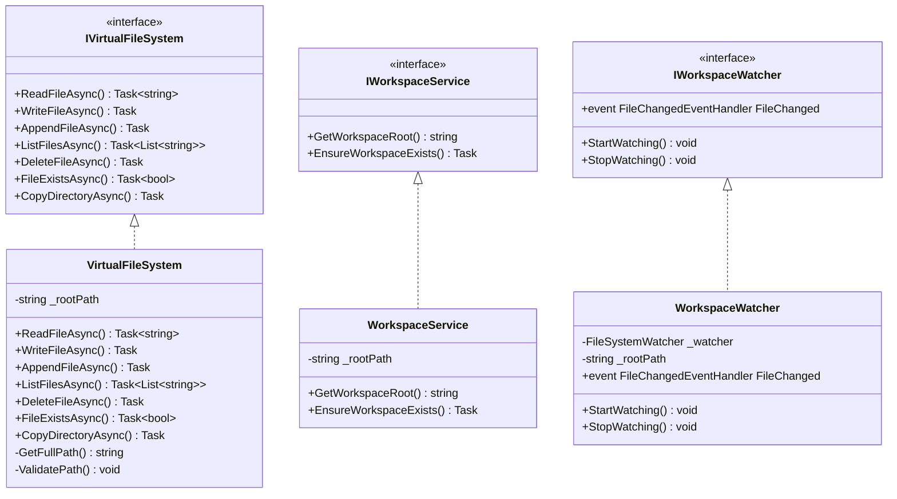

---

## 8. UI 状态类图

### 8.1 ChatState 与视图模型

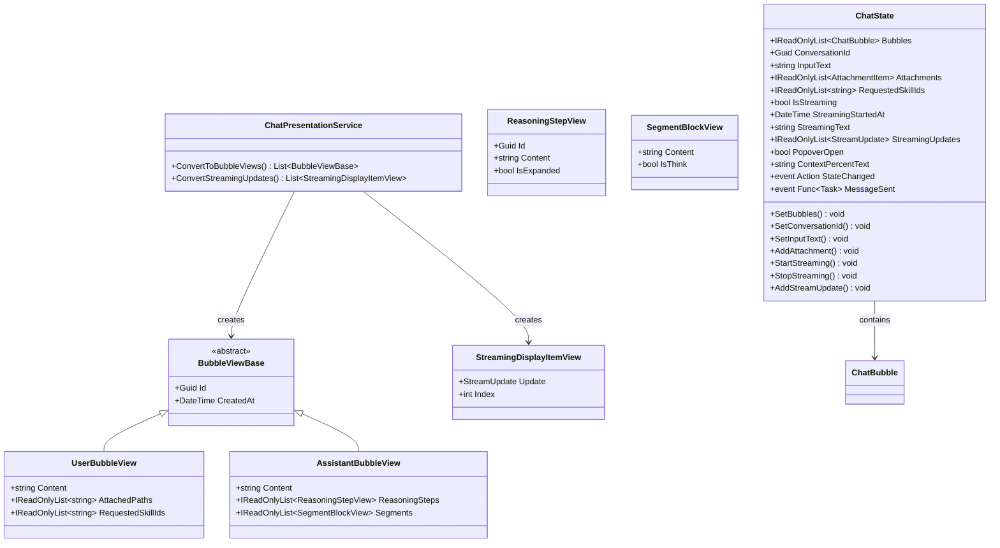

---

## 9. 终端服务类图

### 9.1 命令执行与确认

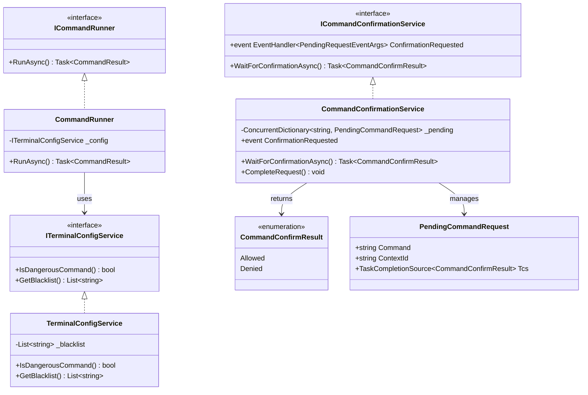

---

## 10. 依赖注入配置类图

### 10.1 服务注册关系

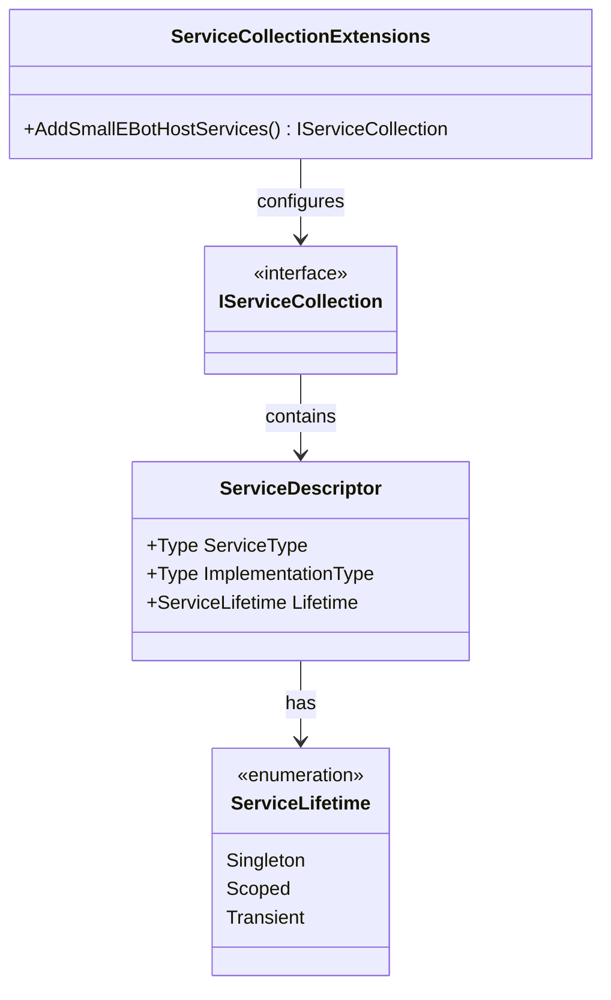

**服务注册说明：**

| 服务 | 生命周期 |
|------|----------|
| DbContext | Scoped |
| Repository | Scoped |
| IAgentConversationService | Scoped |
| IAgentBuilder | Scoped |
| IToolProvider[] | Singleton/Scoped |
| ChatState | Scoped |
| IMcpConnectionManager | Singleton |
